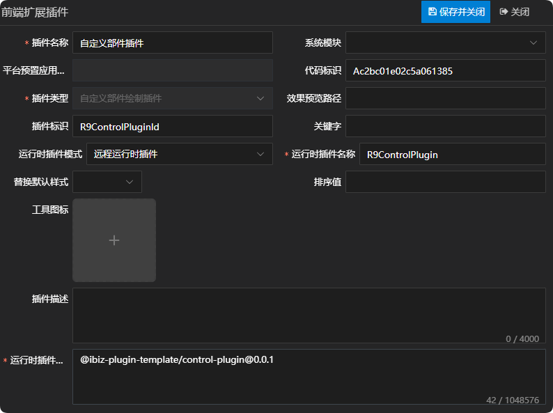
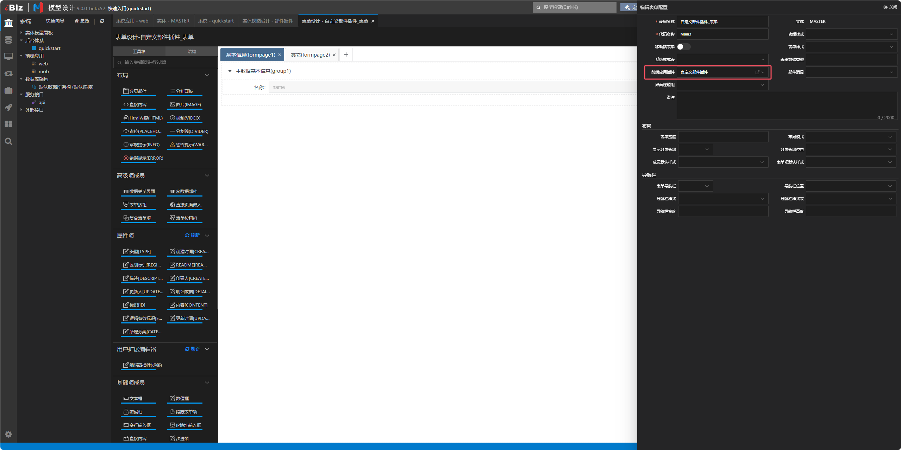
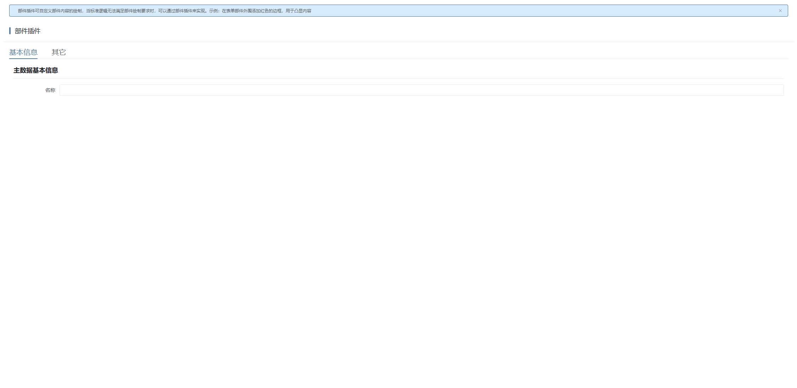
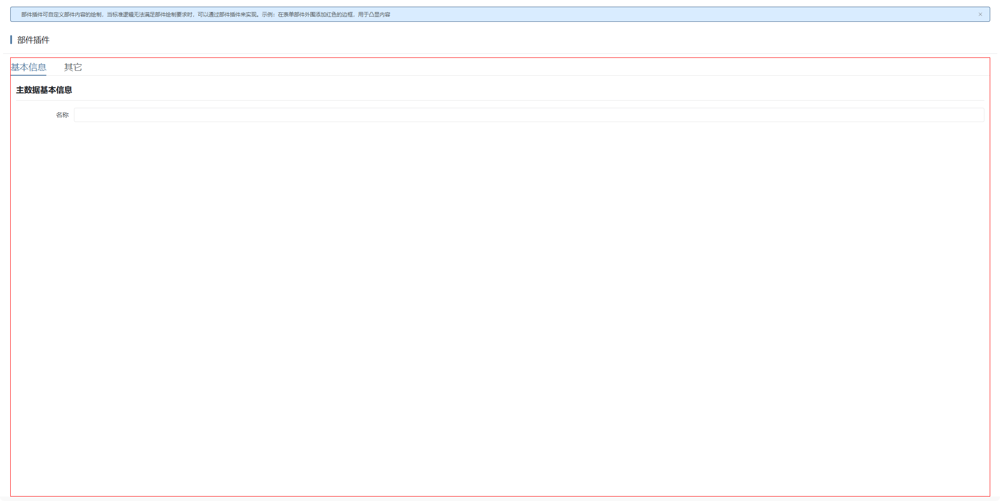

# 部件插件

## 新建自定义部件插件

新建自定义部件插件，这儿唯一需要注意一点的是，运行时插件模式同时支持远程运行时插件，在实际运用的时候需根据当前项目所选择的插件模式来定义。详情参见 [运行时插件模式](./RUNTIME-PLUGIN-MODE.md) 篇。



## 在对应的部件上绑定插件

这儿以表单部件为例：



## 插件机制

视图在绘制部件时，是通过部件适配器上component属性绑定的组件进行绘制的，详情如下：

```tsx
// 绘制部件
const renderControl = (ctrl: IControl, slotProps: IData = {}): VNode => {
  const slotKey = ctrl.name! || ctrl.id!;
  const ctrlProps = getCtrlProps(ctrl, slotProps);
  if (slots[slotKey]) {
    return renderSlot(slots, slotKey, ctrlProps);
  }

  const provider = c.providers[slotKey];
  const comp = resolveComponent(
    provider?.component || 'IBizControlShell',
  ) as string;
  if (provider) {
    ctrlProps.provider = provider;
  }
  return h(comp, ctrlProps);
};
```

如果部件适配器配置了createController方法，则使用createController方法返回的控制器，否则使用传入的控制器。如只需修改控制器逻辑但不改变UI呈现，可直接通过createController方法返回新的控制器即可。详情如下：

```tsx
// 获取部件控制器
function useControlController<T extends IControlController>(
  fn: (...args: ConstructorParameters<typeof ControlController>) => T,
  opts?: Partial<extraOptions>,
): T {
  // 获取上层组件的ctx
  const ctx = useCtx();
  // 获取 props
  const props = useProps();
  // 上下文里提前预告部件
  ctx.evt.emit('onForecast', props.modelData.name!);

  // 实例化部件控制器
  const provider = props.provider as IControlProvider | undefined;
  let c: T;
  if (provider?.createController) {
    // 如果适配器给了创建方法使用适配器的方法
    c = provider.createController(
      props.modelData,
      props.context,
      props.params,
      ctx,
    ) as T;
  } else {
    c = fn(props.modelData, props.context, props.params, ctx);
  }

  // 多数据部件类型往记录导航工具添加当前部件
  if (MDControlTypes.indexOf(c.model.controlType!) !== -1) {
    ibiz.util.record.add(c.ctrlId, c as unknown as IMDControlController);
  }

  watchAndUpdateContextParams(props, c);
  watchAndUpdateState(props, c, opts?.excludePropsKeys);

  c.state = reactive(c.state);

  onActivated(() => c.onActivated());

  onDeactivated(() => c.onDeactivated());

  // 挂载强制更新方法
  c.force = useForce();

  const vue = getCurrentInstance()!.proxy!;
  c.evt.onAll((eventName: string, event: unknown) => {
    vue.$emit(eventName.slice(2), event);
  });

  // vue组件级事件最早的抛出controller
  vue.$emit('controllerAppear', c);

  c.created();

  // 卸载时销毁
  onBeforeUnmount(() => {
    c.destroyed();
    // 多数据部件类型从记录导航工具删除当前部件
    if (MDControlTypes.indexOf(c.model.controlType!) !== -1) {
      ibiz.util.record.remove(c.ctrlId);
    }
  });
  return c;
}
```

## 插件示例

### 插件效果

#### 使用插件前



#### 使用插件后



### 插件结构

```
|─ ─ control-plugin                         部件插件顶层目录，可根据实际业务命名
  |─ ─ src                                  部件插件源代码目录
​    |─ ─ control-plugin.controller.ts       部件插件控制器
​    |─ ─ control-plugin.provider.ts         部件插件适配器
​    |─ ─ control-plugin.scss                部件插件样式
​    |─ ─ control-plugin.tsx                 部件插件组件
​    |─ ─ index.ts                           部件插件入口文件
```

### 部件插件入口文件

部件插件入口文件会全局注册部件插件适配器和部件插件组件，供外部使用。

```typescript
import { App } from 'vue';
import { registerControlProvider } from '@ibiz-template/runtime';
import { ControlPlugin } from './control-plugin';
import { ControlPluginProvider } from './control-plugin.provider';

export default {
  install(app: App) {
    // 全局注册部件插件组件
    app.component(ControlPlugin.name!, ControlPlugin);
    // 全局注册部件插件适配器，CUSTOM是插件类型，R9ControlPluginId是插件标识
    registerControlProvider(
      'CUSTOM_R9ControlPluginId',
      () => new ControlPluginProvider(),
    );
  },
};
```

### 部件插件组件

部件插件组件使用tsx的书写方式，承载部件绘制的内容，可拷贝基础UI绘制，然后根据需求进行调整。其中，基础UI绘制可参考附录中UI呈现部分。

### 部件插件适配器

部件插件适配器主要通过component属性指定部件实际要绘制的组件，并且通过createController方法返回传递给部件的控制器。

### 部件插件控制器

部件插件控制器可继承基础控制器，然后根据需求进行调整。其中，基础控制器可参考附录中控制器部分。

## 本地开发

1. 安装依赖并link至全局

```sh
// 安装依赖
pnpm i

// link底包
./scripts/link.sh

// 启动
pnpm dev

// link到全局
pnpm link --global
```

2. 主项目包中引用插件

```sh
// link插件
pnpm link --global '@ibiz-plugin-template/control-plugin'
```

3. 主项目包中注册插件

```ts
import { App } from 'vue';
import ControlPlugin from '@ibiz-plugin-template/control-plugin';

export default {
  install(app: App): void {
    app.use(ControlPlugin);
    // 设置本地开发需要忽略加载的插件，可填写正则或全匹配字符串。匹配插件在modeling建模平台配置的[运行时插件仓库配置]内容
    ibiz.plugin.setDevIgnore(/^@ibiz-plugin-template\/control-plugin/);
  },
};
```

## 附录

|      部件类型      |         UI呈现         |          控制器           |
| :----------------: | :--------------------: | :-----------------------: |
|      应用菜单      |     AppMenuControl     |     AppMenuController     |
| 应用菜单(图标视图) | AppMenuIconViewControl | AppMenuIconViewController |
|        日历        |    CalendarControl     |    CalendarController     |
|       标题栏       |   CaptionBarControl    |   CaptionBarController    |
|        图表        |      ChartControl      |      ChartController      |
|     上下文菜单     |   ContextMenuControl   |   ContextMenuController   |
|      数据看板      |    DashboardControl    |    DashboardController    |
|        卡片        |    DataViewControl     | DataViewControlController |
|     数据关系栏     |      DRBarControl      |      DRBarController      |
|    数据关系分页    |      DRTabControl      |      DRTabController      |
|     日历导航栏     | CalendarExpBarControl  | CalendarExpBarController  |
|     图表导航栏     |   ChartExpBarControl   |   ChartExpBarController   |
|     卡片导航栏     | DataViewExpBarControl  |  ExpBarControlController  |
|     表格导航栏     |   GridExpBarControl    |  ExpBarControlController  |
|     列表导航栏     |   ListExpBarControl    |  ExpBarControlController  |
|      树导航栏      |   TreeExpBarControl    |   TreeExpBarController    |
|      编辑表单      |    EditFormControl     |    EditFormController     |
|      搜索表单      |   SearchFormControl    |   SearchFormController    |
|       甘特图       |      GanttControl      |      GanttController      |
|        表格        |      GridControl       |      GridController       |
|        看板        |     KanbanControl      |     KanbanController      |
|        列表        |      ListControl       |      ListController       |
|        地图        |       MapControl       |       MapController       |
|   多编辑视图面板   | MEditViewPanelControl  | MEditViewPanelController  |
|    选择视图面板    | PickupViewPanelControl | PickupViewPanelController |
|      报表面板      |   ReportPanelControl   |   ReportPanelController   |
|       搜索栏       |    SearchBarControl    |    SearchBarController    |
|    分页导航面板    |   TabExpPanelControl   |   TabExpPanelController   |
|       工具栏       |     ToolbarControl     |     ToolbarController     |
|         树         |      TreeControl       |      TreeController       |
|       树表格       |    TreeGridControl     |    TreeGridController     |
|   树表格（增强）   |   TreeGridExControl    |   TreeGridExController    |
|      向导面板      |   WizardPanelControl   |   WizardPanelController   |
