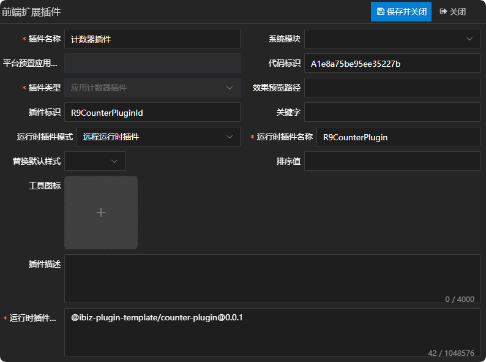
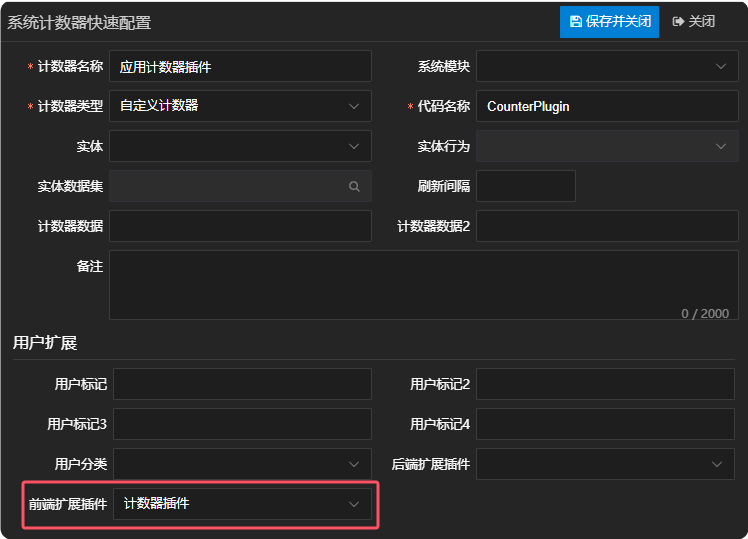
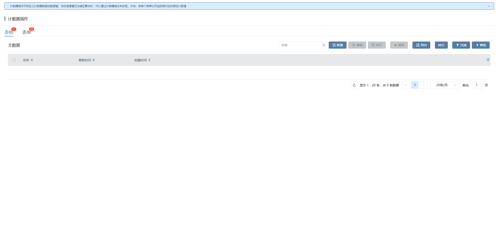

# 计数器插件

## 新建应用计数器插件

新建应用计数器插件，这儿唯一需要注意一点的是，运行时插件模式同时支持远程运行时插件，在实际运用的时候需根据当前项目所选择的插件模式来定义。详情参见 [运行时插件模式](./RUNTIME-PLUGIN-MODE.md) 篇。



## 在对应的计数器上绑定插件



## 插件机制

控制器通过计数器服务获取计数器实例，然后通过监听计数器实例数据变更事件获取变更后的数据。计数器服务内部会通过模型获取对应的计数器适配器，然后调用计数器适配器的createCounter方法获取计数器实例。详情如下：

```typescript
// 获取计数器实例
async initCounter(): Promise<void> {
  this.counters = {};
  const { appCounterRefs } = this.model;
  if (appCounterRefs && appCounterRefs.length > 0) {
    const dataKey: string =
      this.context[calcDeCodeNameById(this.model.appDataEntityId!)];
    try {
      await Promise.all(
        appCounterRefs.map(async counterRef => {
          const counter = await CounterService.getCounterByRef(
            counterRef,
            this.context,
            dataKey
              ? { srfcustomtag: dataKey, ...this.params }
              : { ...this.params },
          );
          this.counters[counterRef.id!] = counter;
        }),
      );
    } catch (error) {
      console.error(error);
    }
  }
}

// 监听计数器数据变更事件获取变更后的数据
let counter: AppCounter | null = null;
const counterData = reactive<IData>({});
const counterRefId = ref('');
const fn = (data: IData) => {
  counterData.value = data;
};
onMounted(() => {
  const defaultSlots: VNode[] = slots.default?.() || [];
  for (let i = 0; i < defaultSlots.length; i++) {
    const slot: VNode = defaultSlots[i];
    const pagePropsC = slot.props?.controller as
      | FormTabPageController
      | undefined;
    if (
      pagePropsC &&
      pagePropsC.model &&
      pagePropsC.model.appCounterRefId
    ) {
      counterRefId.value = pagePropsC.model.appCounterRefId;
      break;
    }
  }
  if (counterRefId.value) {
    counter = props.controller.getCounter(counterRefId.value);
    if (counter) {
      counter.onChange(fn);
    }
  }
});
onUnmounted(() => {
  counter?.offChange(fn);
});

// 获取对应的计数器适配器，然后调用计数器适配器的createCounter方法获取计数器实例
async async getCounter(
  model: IAppCounter,
  context?: IContext,
  params?: IParams,
): Promise<AppCounter> {
  let id = model.id!;
  if (params && params.srfcustomtag) {
    id = params.srfcustomtag;
  }
  if (this.counterMap.has(id)) {
    const counter = this.counterMap.get(id)!;
    if (counter.isDestroyed === false) {
      return counter;
    }
    this.counterMap.delete(id);
  }
  const provider = await getAppCounterProvider(model);
  const counter = provider.createCounter(model);
  await counter.init(context, params);
  this.counterMap.set(id, counter);
  return counter;
}
```

## 插件示例

### 插件效果

给每个表单分页返回其对应的固定计数值



### 插件结构

```
|─ ─ counter-plugin                         计数器插件顶层目录，可根据实际业务命名
  |─ ─ src                                  计数器插件源代码目录
​    |─ ─ counter-plugin.provider.ts         计数器插件适配器
​    |─ ─ counter-plugin.ts                  计数器插件实现类
​    |─ ─ index.ts                           计数器插件入口文件
```

### 计数器插件入口文件

计数器插件入口文件会全局注册计数器插件适配器，供外部使用。

```typescript
import { App } from 'vue';
import { registerAppCounterProvider } from '@ibiz-template/runtime';
import { CounterPluginProvider } from './counter-plugin.provider';

export default {
  install(_app: App) {
    // 全局注册计数器插件适配器, APPCOUNTER是插件类型，R9CounterPluginId是插件标识
    registerAppCounterProvider(
      'APPCOUNTER_R9CounterPluginId',
      () => new CounterPluginProvider(),
    );
  },
};
```

### 计数器插件实现类

计数器插件实现类可继承基础应用计数器AppCounter，重写部分逻辑。

### 计数器插件适配器

计数器插件适配器的createCounter方法返回计数器插件实现类的实例。

## 本地开发

1. 安装依赖并link至全局

```sh
// 安装依赖
pnpm i

// link底包
./scripts/link.sh

// 启动
pnpm dev

// link到全局
pnpm link --global
```

2. 主项目包中引用插件

```sh
// link插件
pnpm link --global '@ibiz-plugin-template/counter-plugin'
```

3. 主项目包中注册插件

```ts
import { App } from 'vue';
import CounterPlugin from '@ibiz-plugin-template/counter-plugin';

export default {
  install(app: App): void {
    app.use(CounterPlugin);
    // 设置本地开发需要忽略加载的插件，可填写正则或全匹配字符串。匹配插件在modeling建模平台配置的[运行时插件仓库配置]内容
    ibiz.plugin.setDevIgnore(/^@ibiz-plugin-template\/counter-plugin/);
  },
};
```
