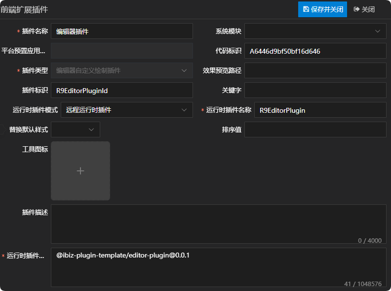
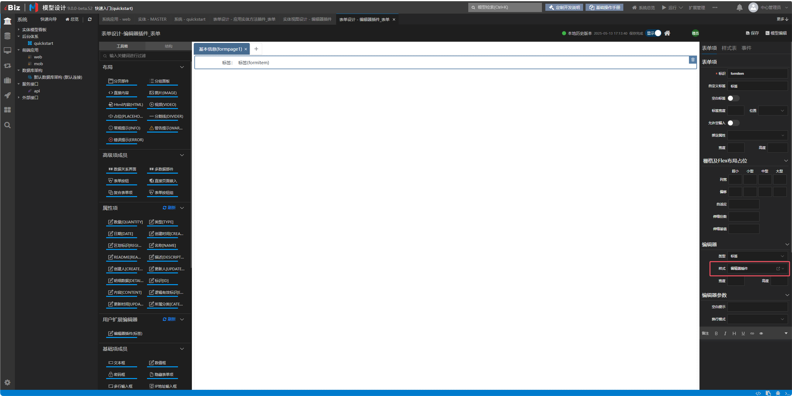

# 编辑器插件

## 新建编辑器自定义绘制插件

新建编辑器自定义绘制插件，这儿唯一需要注意一点的是，运行时插件模式同时支持远程运行时插件，在实际运用的时候需根据当前项目所选择的插件模式来定义。详情参见 [运行时插件模式](./RUNTIME-PLUGIN-MODE.md) 篇。



## 新建编辑器样式

新建编辑器样式，并且绑定上一步新建的编辑器插件。


## 在对应的编辑器上绑定编辑器样式

这儿以span标签编辑器为例：



## 插件机制

表单项在绘制编辑器时，是通过编辑器适配器的formEditor属性去获取组件名称，然后进行绘制的，并且渲染时会将createController方法返回的控制器传给对应的编辑器组件。如只需修改控制器逻辑但不改变UI呈现，可直接通过createController方法返回新的控制器即可。详情如下：

```tsx
// 表单项绘制编辑器
render() {
  if (!this.c.state.visible || this.c.model.editor?.editorType === 'HIDDEN') {
    return null;
  }
  // 编辑器内容
  let editor = null;
  const compositeItem = this.c.model.compositeItem;
  // 复合表单项
  if (compositeItem) {
    const { editorItems = [] } = this.c.model.editor || {};
    editor = editorItems.map((item: IData) => {
      const controller = this.c.form.details[item.id] as FormItemController;
      return (
        <CompositeFormItem
          modelData={controller.model}
          controller={controller}
          attrs={this.attrs}
        />
      );
    });
  } else {
    const editMode = this.c.editor?.model?.editorParams?.editMode;
    const editorProps = {
      style: this.c.editor?.style,
      value: this.c.value,
      data: this.c.data,
      controller: this.c.editor,
      disabled: this.c.state.disabled,
      readonly: this.c.state.readonly,
      onChange: this.onValueChange,
      extraParams: this.extraParams,
      controlParams: editMode
        ? { ...this.c.form.controlParams, editmode: editMode }
        : this.c.form.controlParams,
      onFocus: (event: MouseEvent) => this.c.onFocus(event),
      onBlur: (event: MouseEvent) => this.c.onBlur(event),
      onEnter: (event: MouseEvent) => this.c.onEnter(event),
      onClick: (event: MouseEvent, params: IParams) =>
        this.c.onClick(event, params),
      ...this.attrs,
    };
    if (this.$slots.default) {
      editor = this.$slots.default(editorProps);
    } else if (this.c.editorProvider) {
      const component = resolveComponent(this.c.editorProvider.formEditor);
      editor = h(component, {
        ...editorProps,
      });
    } else {
      editor = (
        <not-supported-editor
          modelData={this.modelData.editor}
          context={this.c.context}
        />
      );
    }
  }

  return (
    <iBizFormItemContainer
      id={`${this.c.form.view.model.codeName}_${this.c.form.model.codeName}_${this.modelData.codeName}`}
      class={[
        this.ns.b(),
        this.ns.m(this.modelData.id),
        this.ns.is('compositeItem', compositeItem),
        ...this.c.containerClass,
      ]}
      style={this.modelData.cssStyle}
      controller={this.c}
      onClick={(event: MouseEvent) => this.c.onClick(event)}
    >
      {editor}
    </iBizFormItemContainer>
  );
}
```

表格在绘制编辑器时，是通过编辑器适配器的gridEditor属性去获取组件名称，然后进行绘制的，并且渲染时会将createController方法返回的控制器传给对应的编辑器组件。如只需修改控制器逻辑但不改变UI呈现，可直接通过createController方法返回新的控制器即可。详情如下：

```tsx
// 表格绘制编辑器
render() {
  const val = this.row.data[this.c.fieldName];

  return (
    <iBizGridEditItem
      {...{
        ref: 'componentRef',
        required: !this.c.editItem.allowEmpty,
        error: this.row.errors[this.c.fieldName],
        overflowMode: this.c.grid.overflowMode,
        class: [
          this.ns,
          this.ns.m(this.c.grid.overflowMode),
          this.controller.model.cellSysCss?.cssName,
        ],
        ...this.gridEditItemProps,
      }}
    >
      {this.c.editorProvider &&
        h(resolveComponent(this.c.editorProvider.gridEditor), {
          class: this.ns.e('editor'),
          value: val,
          data: this.row.data,
          controller: this.c.editor,
          overflowMode: this.c.grid.overflowMode,
          onChange: this.rowDataChange,
          onInfoTextChange: this.onInfoTextChange,
          title: this.tooltip,
          ...this.editorProps,
          ...this.attrs,
        })}
    </iBizGridEditItem>
  );
}
```

## 插件示例

### 插件效果

#### 使用插件前


#### 使用插件后


### 插件结构

```
|─ ─ editor-plugin                         编辑器插件顶层目录，可根据实际业务命名
  |─ ─ src                                 编辑器插件源代码目录
​    |─ ─ editor-plugin.controller.ts       编辑器插件控制器
​    |─ ─ editor-plugin.provider.ts         编辑器插件适配器
​    |─ ─ editor-plugin.scss                编辑器插件样式
​    |─ ─ editor-plugin.tsx                 编辑器插件组件
​    |─ ─ index.ts                          编辑器插件入口文件
```

### 编辑器插件入口文件

编辑器插件入口文件会全局注册编辑器插件适配器和编辑器插件组件，供外部使用。

```typescript
import { registerEditorProvider } from '@ibiz-template/runtime';
import { App } from 'vue';
import { EditorPlugin } from './editor-plugin';
import { EditorPluginProvider } from './editor-plugin.provider';

export default {
  install(app: App) {
    // 全局注册编辑器插件组件
    app.component(EditorPlugin.name!, EditorPlugin);
    // 全局注册编辑器插件适配器，EDITOR_CUSTOMSTYLE是插件类型，R9EditorPluginId是插件标识
    registerEditorProvider(
      'EDITOR_CUSTOMSTYLE_R9EditorPluginId',
      () => new EditorPluginProvider(),
    );
  },
};
```

### 编辑器插件组件

编辑器插件组件使用tsx的书写方式，承载编辑器绘制的内容，可拷贝基础UI绘制，然后根据需求进行调整。其中，基础UI绘制可参考附录中UI呈现部分。

### 编辑器插件适配器

编辑器插件适配器主要通过formEditor属性和gridEditor属性指定编辑器实际要绘制的组件，并且通过createController方法返回需传递给编辑器的控制器。

### 编辑器插件控制器

编辑器插件控制器可继承基础控制器，然后根据需求进行调整。其中，基础控制器可参考附录中控制器部分。

## 本地开发

1. 安装依赖并link至全局

```sh
// 安装依赖
pnpm i

// link底包
./scripts/link.sh

// 启动
pnpm dev

// link到全局
pnpm link --global
```

2. 主项目包中引用插件

```sh
// link插件
pnpm link --global '@ibiz-plugin-template/editor-plugin'
```

3. 主项目包中注册插件

```ts
import { App } from 'vue';
import EditorPlugin from '@ibiz-plugin-template/editor-plugin';

export default {
  install(app: App): void {
    app.use(EditorPlugin);
    // 设置本地开发需要忽略加载的插件，可填写正则或全匹配字符串。匹配插件在modeling建模平台配置的[运行时插件仓库配置]内容
    ibiz.plugin.setDevIgnore(/^@ibiz-plugin-template\/editor-plugin/);
  },
};
```

## 附录

|           编辑器类型           |        UI呈现         |             控制器              |
| :----------------------------: | :-------------------: | :-----------------------------: |
|           数组编辑器           |       IBizArray       |      ArrayEditorController      |
|            自动填充            |   IBizAutoComplete    |  AutoCompleteEditorController   |
|      自动填充（只能选择）      |   IBizAutoComplete    |  AutoCompleteEditorController   |
|       自动填充（无按钮）       |   IBizAutoComplete    |  AutoCompleteEditorController   |
|  自动填充（只能选择、无按钮）  |   IBizAutoComplete    |  AutoCompleteEditorController   |
|           级联选择器           |     IBizCascader      |    CascaderEditorController     |
|             选项框             |     IBizCheckbox      |    CheckBoxEditorController     |
|           选项框列表           |   IBizCheckboxList    |  CheckBoxListEditorController   |
|           代码编辑框           |       IBizCode        |      CodeEditorController       |
|           颜色选择器           |    IBizColorPicker    |   ColorPickerEditorController   |
|         地址框（选择）         |      IBizMPicker      |     PickerEditorController      |
|     地址框（支持选择、AC）     |      IBizMPicker      |     PickerEditorController      |
|            数据选择            |      IBizPicker       |     PickerEditorController      |
|        数据选择（无AC）        |      IBizPicker       |     PickerEditorController      |
|   数据选择（无AC、数据链接）   |      IBizPicker       |     PickerEditorController      |
|   数据选择（下拉、数据链接）   |      IBizPicker       |     PickerEditorController      |
|       数据选择（无按钮）       |      IBizPicker       |     PickerEditorController      |
|        数据选择（下拉）        |  IBizPickerDropDown   |     PickerEditorController      |
|    数据选择（嵌入选择视图）    |  IBizPickerEmbedView  |     PickerEditorController      |
|      数据选择（数据链接）      |    IBizPickerLink     |     PickerEditorController      |
|            数据链接            |    IBizPickerLink     |     PickerEditorController      |
|      数据选择（下拉视图）      | IBizPickerSelectView  |     PickerEditorController      |
| 数据选择（下拉视图、数据链接） | IBizPickerSelectView  |     PickerEditorController      |
|           时间选择器           |    IBizDatePicker     |   DatePickerEditorController    |
|         时间范围选择器         |  IBizDateRangePicker  |    DateRangeEditorController    |
|           下拉列表框           |     IBizDropdown      |  DropDownListEditorController   |
|           HTML编辑框           |       IBizHtml        |      HtmlEditorController       |
|         列表框（选择）         |      IBizListBox      |     ListBoxEditorController     |
|         Markdown编辑框         |     IBizMarkDown      |    MarkDownEditorController     |
|         数值范围编辑框         | IBizNumberRangePicker |   NumberRangeEditorController   |
|           单选项列表           |       IBizRadio       | RadioButtonListEditorController |
|             评分器             |       IBizRate        |      RateEditorController       |
|            直接内容            |        IBizRaw        |       RawEditorController       |
|           滑动输入条           |      IBizSlider       |     SliderEditorController      |
|              标签              |       IBizSpan        |      SpanEditorController       |
|        标签（数据链接）        |     IBizSpanLink      |      SpanEditorController       |
|             步进器             |      IBizStepper      |     StepperEditorController     |
|            开关部件            |      IBizSwitch       |     SwitchEditorController      |
|          IP地址输入框          |      IBizInputIP      |     TextBoxEditorController     |
|             数值框             |    IBizInputNumber    |     TextBoxEditorController     |
|             文本框             |       IBizInput       |     TextBoxEditorController     |
|             密码框             |       IBizInput       |     TextBoxEditorController     |
|           多行输入框           |       IBizInput       |     TextBoxEditorController     |
|            文件控件            |    IBizFileUpload     |     UploadEditorController      |
|   图片控件（单项、直接内容）   |   IBizImagePreview    |     UploadEditorController      |
|            图片控件            |    IBizImageUpload    |     UploadEditorController      |
