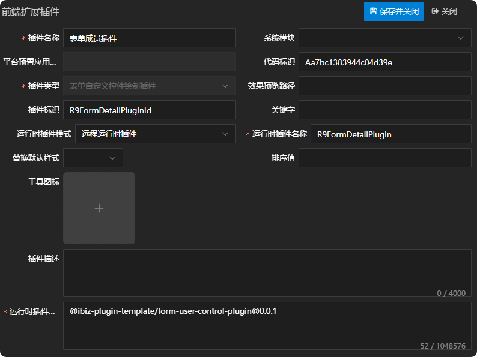
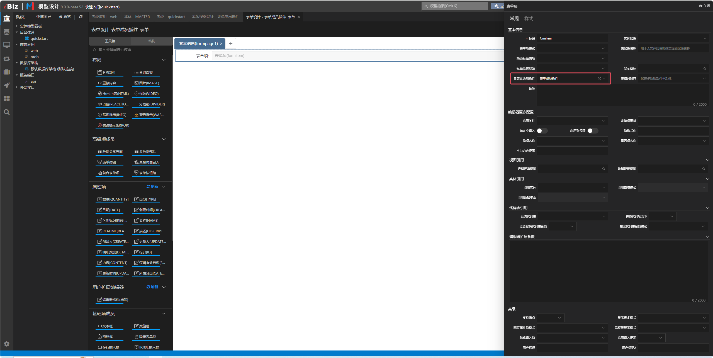
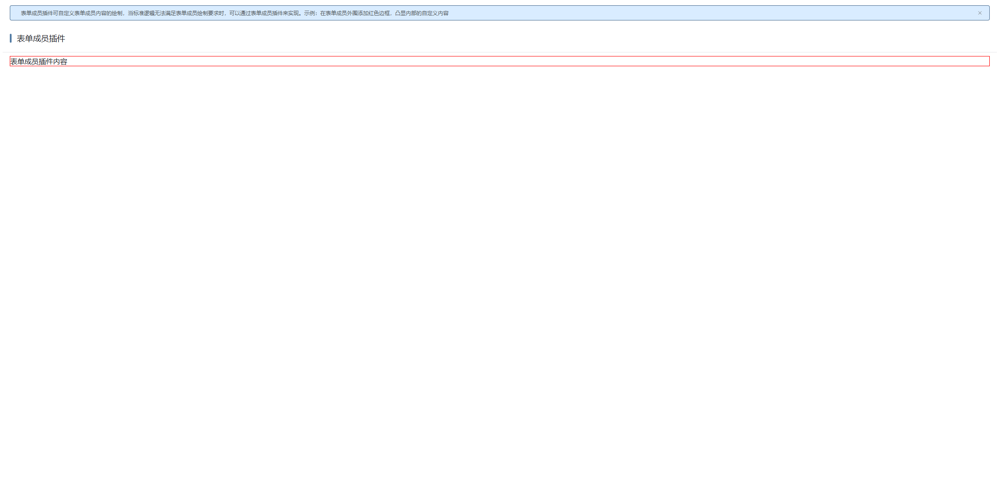

# 表单成员插件示例

## 新建表单自定义控件绘制插件

新建表单自定义控件绘制插件，这儿唯一需要注意一点的是，运行时插件模式同时支持远程运行时插件，在实际运用的时候需根据当前项目所选择的插件模式来定义。详情参见 [运行时插件模式](./RUNTIME-PLUGIN-MODE.md) 篇。



## 在对应的表单成员上绑定插件

这儿以表单项为例：



## 插件机制

表单在绘制表单成员时，是通过表单成员适配器上的component属性去获取组件名称，然后进行绘制的，并且渲染时会将createController方法返回的控制器传给对应的表单成员组件。如只需修改控制器逻辑但不改变UI呈现，可直接通过createController方法返回新的控制器即可。详情如下：

```ts
// 绘制表单成员
const renderByDetailType = (
  detail: IDEFormDetail,
): VNode | VNode[] | undefined => {
  if ((detail as IDEFormItem).hidden) {
    return;
  }
  const detailId = detail.id!;

  // 有插槽走插槽
  if (slots[detailId]) {
    return renderSlot(slots, detailId, {
      model: detail,
      data: c.state.data,
      value: c.state.data[detailId],
    });
  }

  // 子插槽
  const childSlots: IData = {};
  // 表单项如果有编辑器插槽的时候，调用插槽绘制表单项的默认插槽。
  if (detail.detailType === 'FORMITEM' && slots[`${detailId}_editor`]) {
    childSlots.default = (...args: IData[]): VNode[] => {
      return slots[`${detailId}_editor`]!(...args);
    };
  }
  const childDetails = findChildFormDetails(detail);
  if (childDetails.length) {
    // 容器成员绘制子成员
    childSlots.default = (): (VNode[] | VNode | undefined)[] =>
      childDetails.map(child => {
        return renderByDetailType(child);
      });
  }

  // 根据适配器绘制表单成员
  const provider = c.providers[detailId];
  if (!provider) {
    return (
      <div>
        {ibiz.i18n.t('control.form.noSupportDetailType', {
          detailType: detail.detailType,
        })}
      </div>
    );
  }
  const component = resolveComponent(provider.component) as string;
  return h(
    component,
    {
      modelData: detail,
      controller: c.details[detailId],
      key: detail.id,
      attrs: renderAttrs(detail),
    },
    childSlots,
  );
};
```

## 插件示例

### 插件效果

#### 使用插件前


#### 使用插件后



### 插件结构

```
|─ ─ form-user-control-plugin                    表单成员插件顶层目录，可根据实际业务命名
  |─ ─ src                                       表单成员插件源代码目录
​    |─ ─ form-user-control-plugin.controller.ts  表单成员插件控制器
​    |─ ─ form-user-control-plugin.provider.ts    表单成员插件适配器
​    |─ ─ form-user-control-plugin.scss           表单成员插件样式
​    |─ ─ form-user-control-plugin.tsx            表单成员插件组件
​    |─ ─ index.ts                                表单成员插件入口文件
```

### 表单成员插件入口文件

表单成员插件入口文件会全局注册表单成员插件适配器和表单成员插件组件，供外部使用。

```typescript
import { App } from 'vue';
import { registerFormDetailProvider } from '@ibiz-template/runtime';
import { FormUserControlPlugin } from './form-user-control-plugin';
import { FormUserControlPluginProvider } from './form-user-control-plugin.provider';

export default {
  install(app: App) {
    // 全局注册表单成员插件组件
    app.component(FormUserControlPlugin.name!, FormUserControlPlugin);
    // 全局注册表单成员插件适配器，FORM_USERCONTROL是插件类型，R9FormDetailPluginId是插件标识
    registerFormDetailProvider(
      'FORM_USERCONTROL_R9FormDetailPluginId',
      () => new FormUserControlPluginProvider(),
    );
  },
};
```

### 表单成员插件组件

表单成员插件组件使用tsx的书写方式，承载表单成员绘制的内容，可拷贝基础UI绘制，然后根据需求进行调整。其中，基础UI绘制可参考附录中UI呈现部分。

### 表单成员插件适配器

表单成员插件适配器主要通过component属性指定表单成员实际要绘制的组件，并且通过createController方法返回需传递给表单成员的控制器。

### 表单成员插件控制器

表单成员插件控制器可继承基础控制器，然后根据需求进行调整。其中，基础控制器可参考附录中控制器部分。

## 本地开发

1. 安装依赖并link至全局

```sh
// 安装依赖
pnpm i

// link底包
./scripts/link.sh

// 启动
pnpm dev

// link到全局
pnpm link --global
```

2. 主项目包中引用插件

```sh
// link插件
pnpm link --global '@ibiz-plugin-template/form-user-control-plugin'
```

3. 主项目包中注册插件

```ts
import { App } from 'vue';
import FormUserControlPlugin from '@ibiz-plugin-template/form-user-control-plugin';

export default {
  install(app: App): void {
    app.use(FormUserControlPlugin);
    // 设置本地开发需要忽略加载的插件，可填写正则或全匹配字符串。匹配插件在modeling建模平台配置的[运行时插件仓库配置]内容
    ibiz.plugin.setDevIgnore(
      /^@ibiz-plugin-template\/form-user-control-plugin/,
    );
  },
};
```

## 附录

|  表单成员类型  |     UI呈现     |          控制器          |
| :------------: | :------------: | :----------------------: |
|    表单按钮    |   FormButton   |   FormButtonController   |
|   表单按钮组   | FormButtonList | FormButtonListController |
|  表单关系界面  |  FormDRUIPart  |  FormDRUIPartController  |
|  表单分组面板  | FormGroupPanel | FormGroupPanelController |
|     表单项     |    FormItem    |    FormItemController    |
| 表单多数据部件 |   FormMDCtrl   |   FormMDCtrlController   |
|    表单分页    |  FormPageItem  |    FormPageController    |
|  表单直接内容  |  FormRawItem   |  FormRawItemController   |
|  表单tab分页   |  FormTabPage   |  FormTabPageController   |
|  表单tab面板   |  FormTabPanel  |  FormTabPanelController  |
