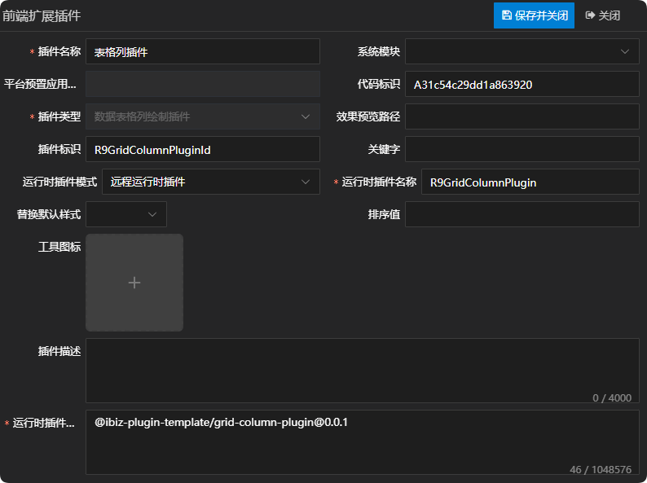
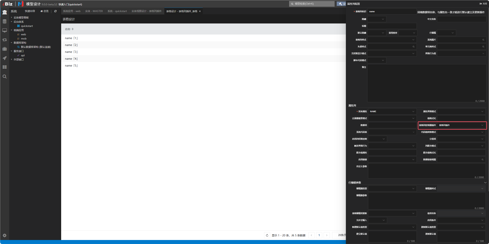
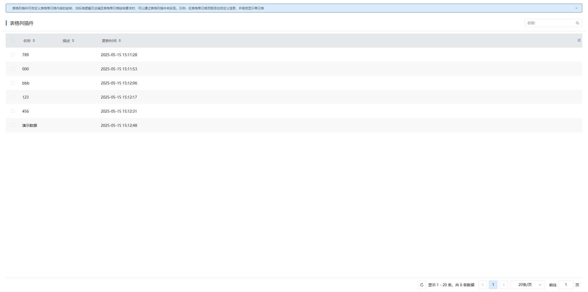
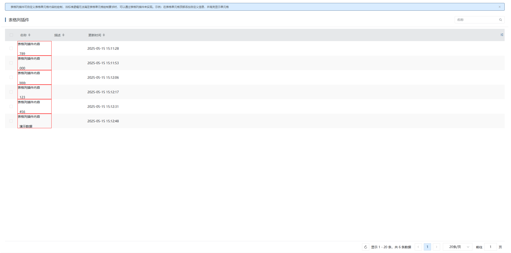

## 表格列插件

## 新建数据表格列绘制插件

新建数据表格列绘制插件，这儿唯一需要注意一点的是，运行时插件模式同时支持远程运行时插件，在实际运用的时候需根据当前项目所选择的插件模式来定义。详情参见 [运行时插件模式](./RUNTIME-PLUGIN-MODE.md) 篇。



## 在对应的表格列上绑定插件



## 插件机制

表格在绘制表格列时，是通过表格列适配器上的component属性去获取组件名称，然后进行绘制的，并且渲染时会将createController方法返回的控制器传给对应的表格列组件。如只需修改控制器逻辑但不改变UI呈现，可直接通过createController方法返回新的控制器即可。详情如下：

```tsx
// 绘制表格列
function renderColumn(
  c: GridController,
  model: IDEGridColumn,
  renderColumns: IDEGridColumn[],
  index: number,
): VNode | null {
  const { codeName: columnName, width } = model;

  // 查缓存，有缓存用缓存，没缓存的用模型
  const columnC = c.columns[columnName!];
  const columnState = c.state.columnStates.find(
    item => item.key === columnName,
  )!;

  // 如果没有配置自适应列，则最后一列变为自适应列
  const widthFlexGrow =
    columnC.isAdaptiveColumn ||
    (!c.hasAdaptiveColumn && index === renderColumns.length - 1);

  const widthName = widthFlexGrow ? 'min-width' : 'width';

  const tempWidth = columnState?.columnWidth || width;
  // 表格列自定义
  return (
    <el-table-column
      className={model.columnType?.toLowerCase()}
      label={model.caption}
      prop={columnName}
      {...{ [widthName]: tempWidth }}
      fixed={columnState.fixed}
      sortable={
        model.enableSort ? c.model.sortMode === 'LOCAL' || 'custom' : false
      }
      sortMethod={(a: IData, b: IData) => {
        const fieldName = model.id!.toLowerCase();
        if (a[fieldName] < b[fieldName] || !a[fieldName]) return -1;
        if (a[fieldName] > b[fieldName] || !b[fieldName]) return 1;
        return 0;
      }}
      align={model.align?.toLowerCase() || 'center'}
    >
      {{
        header: ({ column }: IData) => {
          return (
            <iBizGridColumnHeader key={column.property} controller={columnC} />
          );
        },
        default: ({ row }: IData): VNode | null => {
          let elRow = row; // element表格数据
          if (row.isGroupData) {
            // 有第一条数据时，分组那一行绘制第一条数据
            elRow = row.first;
          }

          const rowState = c.findRowState(elRow);
          if (rowState) {
            // 常规非业务单元格由表格绘制（性能优化）
            if (
              model.columnType === 'DEFGRIDCOLUMN' ||
              model.columnType === 'DEFTREEGRIDCOLUMN'
            ) {
              if (
                c.providers[columnName!].component === 'IBizGridFieldColumn' &&
                !columnC.isCustomCode &&
                !(columnC as GridFieldColumnController).codeList
              ) {
                return renderFieldColumn(
                  columnC as GridFieldColumnController,
                  rowState,
                );
              }
            }
            const comp = resolveComponent(c.providers[columnName!].component);
            return h(comp, {
              controller: columnC,
              row: rowState,
              key: elRow.tempsrfkey + columnName,
              attrs: renderAttrs(model, {
                ...c.getEventArgs(),
                data: rowState.data,
              }),
            });
          }
          return null;
        },
      }}
    </el-table-column>
  );
}
```

## 插件示例

### 插件效果

#### 使用插件前



#### 使用插件后



### 插件结构

```
|─ ─ grid-column-plugin                         表格列插件顶层目录，可根据实际业务命名
  |─ ─ src                                      表格列插件源代码目录
​    |─ ─ grid-column-plugin.controller.ts       表格列插件控制器
​    |─ ─ grid-column-plugin.provider.ts         表格列插件适配器
​    |─ ─ grid-column-plugin.scss                表格列插件样式
​    |─ ─ grid-column-plugin.tsx                 表格列插件组件
​    |─ ─ index.ts                               表格列插件入口文件
```

### 表格列插件入口文件

表格列插件入口文件会全局注册表格列插件适配器和表格列插件组件，供外部使用。

```typescript
import { App } from 'vue';
import { registerGridColumnProvider } from '@ibiz-template/runtime';
import { GridColumnPlugin } from './grid-column-plugin';
import { GridColumnPluginProvider } from './grid-column-plugin.provider';

export default {
  install(app: App) {
    // 全局注册表格列插件组件
    app.component(GridColumnPlugin.name!, GridColumnPlugin);
    // 全局注册表格列插件适配器，GRID_COLRENDER是插件类型，R9GridColumnPluginId是插件标识
    registerGridColumnProvider(
      'GRID_COLRENDER_R9GridColumnPluginId',
      () => new GridColumnPluginProvider(),
    );
  },
};
```

### 表格列插件组件

表格列插件组件使用tsx的书写方式，承载表格列绘制的内容，可拷贝基础UI绘制，然后根据需求进行调整。其中，基础UI绘制可参考附录中UI呈现部分。

### 表格列插件适配器

表格列插件适配器主要通过component属性指定表格列单元格实际要绘制的组件，并且通过createController方法返回需传递给表格列的控制器。

### 表格列插件控制器

表格列插件控制器可继承基础控制器，然后根据需求进行调整。其中，基础控制器可参考附录中控制器部分。

## 本地开发

1. 安装依赖并link至全局

```sh
// 安装依赖
pnpm i

// link底包
./scripts/link.sh

// 启动
pnpm dev

// link到全局
pnpm link --global
```

2. 主项目包中引用插件

```sh
// link插件
pnpm link --global '@ibiz-plugin-template/grid-column-plugin'
```

3. 主项目包中注册插件

```ts
import { App } from 'vue';
import GridColumnPlugin from '@ibiz-plugin-template/grid-column-plugin';

export default {
  install(app: App): void {
    app.use(GridColumnPlugin);
    // 设置本地开发需要忽略加载的插件，可填写正则或全匹配字符串。匹配插件在modeling建模平台配置的[运行时插件仓库配置]内容
    ibiz.plugin.setDevIgnore(/^@ibiz-plugin-template\/grid-column-plugin/);
  },
};
```

## 附录

|     表格列类型     |       UI呈现        |            控制器             |
| :----------------: | :-----------------: | :---------------------------: |
|       属性列       |   GridFieldColumn   |   GridFieldColumnController   |
| 属性列(开启行编辑) | GridFieldEditColumn | GridFieldEditColumnController |
|       分组列       |   GridGroupColumn   |   GridGroupColumnController   |
|       操作列       |    GridUAColumn     |    GridUAColumnController     |
