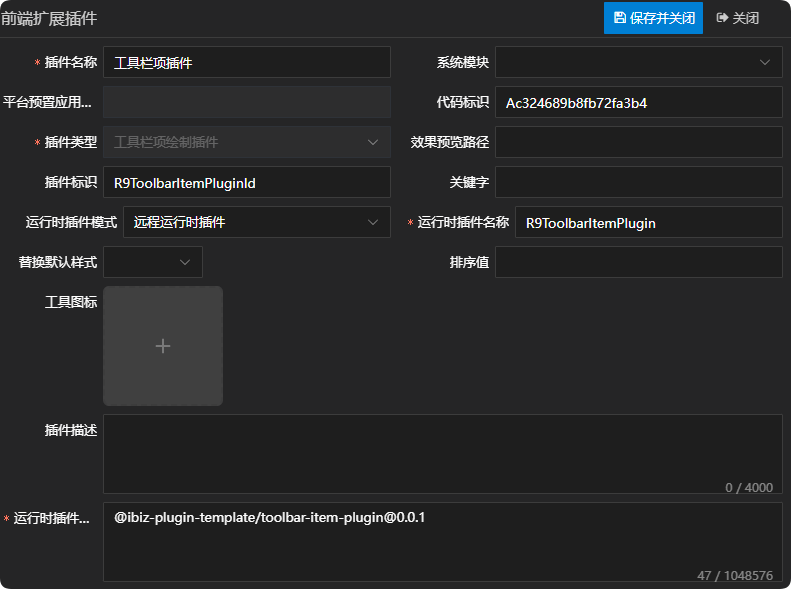
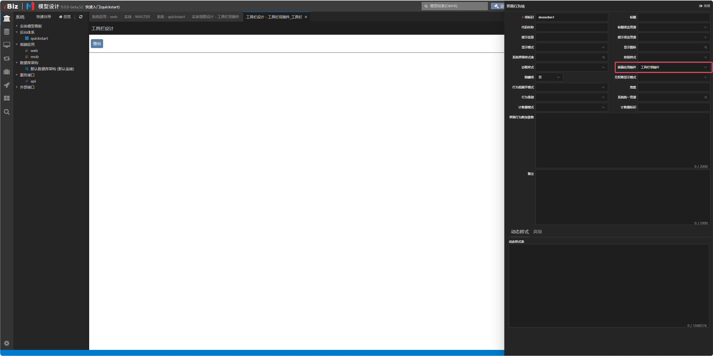
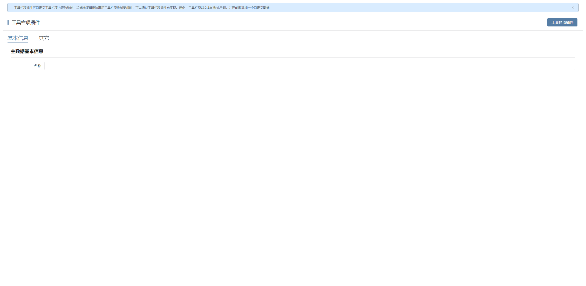
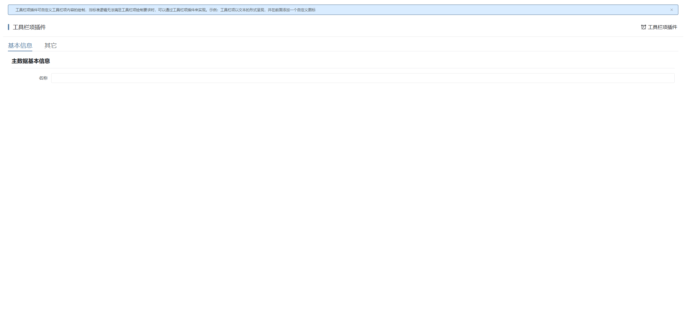

# 工具栏项插件

## 新建工具栏项绘制插件

新建工具栏项绘制插件，这儿唯一需要注意一点的是，运行时插件模式同时支持远程运行时插件，在实际运用的时候需根据当前项目所选择的插件模式来定义。详情参见 [运行时插件模式](./RUNTIME-PLUGIN-MODE.md) 篇。



## 在对应的工具栏项上绑定插件



## 插件机制

工具栏在绘制工具栏项时，会先通过工具栏项模型拿到对应的适配器，若适配器存在，则绘制适配器component属性绑定的组件，否则根据工具栏内部逻辑进行绘制。详情如下：

```tsx
// 绘制工具栏项
const renderToolbarItem = (item: IDEToolbarItem): VNode | null => {
  const itemId = item.id!;
  const visible = c.state.buttonsState[itemId]?.visible;
  const provider = c.itemProviders[itemId];
  if (!visible) {
    return null;
  }
  if (provider) {
    const component = resolveComponent(provider.component);
    return h(component, {
      key: itemId,
      class: [ns.e('item')],
      item,
      controller: c,
    });
  }
  if (item.itemType === 'SEPERATOR') {
    if (c.state.hideSeparator.includes(itemId)) {
      return null;
    }
    return (
      <div key={itemId} class={[ns.e('item'), ns.e('item-separator')]}>
        |
      </div>
    );
  }
  if (item.itemType === 'RAWITEM') {
    return (
      <div key={itemId} class={[ns.e('item'), ns.e('item-rawitem')]}>
        <iBizRawItem
          rawItem={item}
          content={(item as IData).rawItem.content}
          onClick={(e: MouseEvent): Promise<void> => handleClick(item, e)}
        ></iBizRawItem>
      </div>
    );
  }
  if (item.itemType === 'DEUIACTION') {
    const actionId = (item as IDETBUIActionItem).uiactionId;
    const buttonStyle = (item as IDETBUIActionItem).buttonStyle;
    if (actionId === 'exportexcel' || actionId === 'gridview_exportaction') {
      return (
        <IBizExportExcel
          class={[
            ns.e('item'),
            ns.e('item-deuiaction'),
            ns.em('item', buttonStyle?.toLowerCase()),
            calcCssName(item),
          ]}
          item={item}
          btnContent={(barItem: IDEToolbarItem) => btnContent(barItem, c.state)}
          size={btnSize.value}
          controller={c}
          onExportExcel={(e: MouseEvent, data: IData): void => {
            handleClick(item, e, data);
          }}
        ></IBizExportExcel>
      );
    }
    if (actionId === 'shortcut') {
      return (
        <IBizShortCutButton
          key={itemId}
          class={[
            ns.e('item'),
            ns.e('item-deuiaction'),
            ns.em('item', buttonStyle?.toLowerCase()),
            calcCssName(item),
          ]}
          item={item}
          controller={c}
          size={btnSize.value}
          onClick={(e: MouseEvent): Promise<void> => handleClick(item, e)}
        />
      );
    }
    return (
      <div
        key={itemId}
        class={[
          ns.e('item'),
          ns.e('item-deuiaction'),
          ns.em('item', buttonStyle?.toLowerCase()),
          calcCssName(item),
          ns.is('loading', c.state.buttonsState[itemId].loading),
        ]}
      >
        <el-button
          size={btnSize.value}
          title={showTitle(item.tooltip)}
          type={convertBtnType(buttonStyle)}
          loading={c.state.buttonsState[itemId].loading}
          disabled={c.state.buttonsState[itemId].disabled}
          onClick={(e: MouseEvent): Promise<void> => handleClick(item, e)}
        >
          {btnContent(item, c.state)}
        </el-button>
      </div>
    );
  }
  if (item.itemType === 'ITEMS') {
    const groupItem = item as IDETBGroupItem;
    const groupButtonStyle = groupItem.buttonStyle || '';

    if (groupItem.groupExtractMode && groupItem.uiactionGroup) {
      const extractName = `extract-mode-${
        groupItem.groupExtractMode?.toLowerCase() || 'item'
      }`;
      return (
        <div
          class={[
            ns2.b(),
            ns2.e(extractName),
            ns2.em('item', groupButtonStyle.toLowerCase()),
            calcCssName(item),
          ]}
        >
          {renderActionGroup(item)}
        </div>
      );
    }
    return (
      <el-menu
        mode='horizontal'
        class={[
          ns.e('menu'),
          ns.em('menu', groupButtonStyle.toLowerCase()),
          calcCssName(item),
        ]}
        ellipsis={false}
        menu-trigger='hover'
      >
        {renderSubmenu(item)}
      </el-menu>
    );
  }
  return null;
};
```

## 插件示例

### 插件效果

#### 使用插件前



#### 使用插件后



### 插件结构

```
|─ ─ toolbar-item-plugin                         工具栏项插件顶层目录，可根据实际业务命名
  |─ ─ src                                       工具栏项插件源代码目录
​    |─ ─ toolbar-item-plugin.provider.ts         工具栏项插件适配器
​    |─ ─ toolbar-item-plugin.scss                工具栏项插件样式
​    |─ ─ toolbar-item-plugin.tsx                 工具栏项插件组件
​    |─ ─ index.ts                                工具栏项插件入口文件
```

### 工具栏项插件入口文件

工具栏项插件入口文件会全局注册工具栏项插件适配器和工具栏项插件组件，供外部使用。

```typescript
import { App } from 'vue';
import { registerToolbarItemProvider } from '@ibiz-template/runtime';
import { ToolbarItemPlugin } from './toolbar-item-plugin';
import { ToolbarItemPluginProvider } from './toolbar-item-plugin.provider';

export default {
  install(app: App) {
    // 全局注册工具栏项插件组件
    app.component(ToolbarItemPlugin.name!, ToolbarItemPlugin);
    // 全局注册工具栏项插件适配器，TOOLBAR_ITEM是插件类型，R9ToolbarItemPluginId是插件标识
    registerToolbarItemProvider(
      'TOOLBAR_ITEM_R9ToolbarItemPluginId',
      () => new ToolbarItemPluginProvider(),
    );
  },
};
```

### 工具栏项插件组件

工具栏项插件组件使用tsx的书写方式，承载工具栏项绘制的内容，可根据需求自定义内容呈现。

### 工具栏项插件适配器

工具栏项插件适配器主要通过component属性指定工具栏项实际要绘制的组件。

## 本地开发

1. 安装依赖并link至全局

```sh
// 安装依赖
pnpm i

// link底包
./scripts/link.sh

// 启动
pnpm dev

// link到全局
pnpm link --global
```

2. 主项目包中引用插件

```sh
// link插件
pnpm link --global '@ibiz-plugin-template/toolbar-item-plugin'
```

3. 主项目包中注册插件

```ts
import { App } from 'vue';
import ToolbarItemPlugin from '@ibiz-plugin-template/toolbar-item-plugin';

export default {
  install(app: App): void {
    app.use(ToolbarItemPlugin);
    // 设置本地开发需要忽略加载的插件，可填写正则或全匹配字符串。匹配插件在modeling建模平台配置的[运行时插件仓库配置]内容
    ibiz.plugin.setDevIgnore(/^@ibiz-plugin-template\/toolbar-item-plugin/);
  },
};
```
