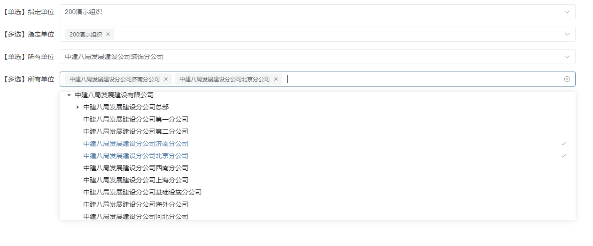

# 单位选择器

单位选择器通常用于为管理人员指定或更改其所属单位。在组织或企业的管理系统中，单位选择器允许管理员或授权用户从预定义的单位列表中选择一个单位，并将其分配给特定的管理人员。主要目的是确保系统中的管理人员被正确分类和组织，以便他们可以访问特定单位的相关信息、数据和功能。隶属于**编辑器插件（基于数据选择标准编辑器扩展）**。



## 输入参数

| 属性名      | 描述                                                         | 类型      | 默认值                                                       |
| ----------- | ------------------------------------------------------------ | --------- | ------------------------------------------------------------ |
| url         | 单位列表的请求路径                                           | string    | —                                                            |
| requestMode | 单位列表的请求方式                                           | get\|post | get                                                          |
| filter      | url中\${orgid} 字符串替换为表单数据或上下文数据，表单数据优先 | string    | srforgid                                                     |
| multiple    | 是否多选                                                     | boolean   | false                                                        |
| fillMap     | 填充对象，指定如何将选择的单位数据填入表单，由选中单位数据属性名称为键，填充表单属性名称为值组成的对象 | object    | {id: 表单值项名称，name: 表单项名称}                         |
| inputMap    | 输入对象，指定请求响应数据如何处理成UI所需的数据结构，UI所需属性名称（id、label、children、disabled）为键，映射响应数据属性名称为值，而responseField主要为解决响应数据结构差异 | object    | { id: 'id',label: 'label', children:'children',disabled: 'disabled', responseField: ''} |

## 事件

| 事件名 | 说明               | 参数                                                        |
| ------ | ------------------ | ----------------------------------------------------------- |
| change | 单位数据值选中事件 | 2个参数，分别是当前选择的值, 当前容器项（eg：表单项）的名称 |

## 扩展插件

| 名称                                     | 标识           | 说明                                                         | 参数                                         |
| ---------------------------------------- | -------------- | ------------------------------------------------------------ | -------------------------------------------- |
| 【单选】单位（全部单位）                 | ALLORGSELECT   | 全部单位选择，强行按照 filter=alls来处理，不接收参数，查询就是全部单位 | url=/sysorganizations/alls/suborg/picker     |
| 【多选】单位（全部单位）                 | ALLORGMULTIPLE | 全部单位选择，强行按照 filter=alls来处理，不接收参数，查询就是全部单位 | url=/sysorganizations/alls/suborg/picker     |
| multiple=true                            |                |                                                              |                                              |
| 【单选】单位（仅含指定单位及其下级单位） | ORGSELECT      | filter=指定单位id对应的表单项名称，不设置时filter默认取当前登录人的所在单位srforgid | url=/sysorganizations/${orgid}/suborg/picker |
| filter=srforgid                          |                |                                                              |                                              |
| 【多选】单位（仅含指定单位及其下级单位） | ORGMULTIPLE    | filter=指定单位id对应的表单项名称，不设置时filter默认取当前登录人的所在单位srforgid | url=/sysorganizations/${orgid}/suborg/picker |

filter=srforgid
multiple=true |

## 基本使用

在具体项目中，先通过模型导入编辑器插件、再导入编辑器样式，最后在具体的表单中选择对应的编辑器样式即可复用，其中编辑器插件和编辑器样式具体数据参见附录。

## 附录

### 编辑器插件

```json
[
  {
    "plugintype": "EDITOR_CUSTOMSTYLE",
    "rtobjectrepo": "@ibiz-template-plugin/org-select@0.1.4-alpha.1",
    "codename": "UsrPFPlugin1211724100",
    "plugintag": "ORGSELECT",
    "rtobjectmode": 2,
    "rtobjectname": "IBizOrgSelect",
    "pssyspfpluginname": "单位选择"
  }
]
```

### 编辑器样式

```json
[
  {
    "codename": "ORGMULTIPLE",
    "pssyspfpluginid": "UsrPFPlugin1211724100",
    "memo": "filter=指定单位id对应的表单项名称，不设置时filter默认取当前登录人的所在单位srforgid\nurl=SYS_organizations/${orgid}/suborg/picker",
    "repdefault": 0,
    "validflag": 1,
    "pssyseditorstylename": "【多选】单位（仅含指定单位及其下级单位）",
    "ctrlparams": "url=/sysorganizations/${orgid}/suborg/picker\nfilter=srforgid\nmultiple=true",
    "pseditortypeid": "PICKER"
  },
  {
    "codename": "ALLORGMULTIPLE",
    "pssyspfpluginid": "UsrPFPlugin1211724100",
    "memo": "全部单位选择，强行按照  filter=alls来处理，不接收参数，查询就是全部单位\nurl=SYS_organizations/alls/suborg/picker",
    "repdefault": 0,
    "validflag": 1,
    "pssyseditorstylename": "【多选】单位（全部单位）",
    "ctrlparams": "url=/sysorganizations/alls/suborg/picker\nmultiple=true",
    "pseditortypeid": "PICKER"
  },
  {
    "codename": "ORGSELECT",
    "pssyspfpluginid": "UsrPFPlugin1211724100",
    "memo": "filter=指定单位id对应的表单项名称，不设置时filter默认取当前登录人的所在单位srforgid\nurl=SYS_organizations/${orgid}/suborg/picker",
    "repdefault": 0,
    "validflag": 1,
    "pssyseditorstylename": "【单选】单位（仅含指定单位及其下级单位）",
    "ctrlparams": "url=/sysorganizations/${orgid}/suborg/picker\nfilter=srforgid",
    "pseditortypeid": "PICKER"
  },
  {
    "codename": "ALLORGSELECT",
    "pssyspfpluginid": "UsrPFPlugin1211724100",
    "memo": "全部单位选择，强行按照  filter=alls来处理，不接收参数，查询就是全部单位\nurl=SYS_organizations/alls/suborg/picker",
    "repdefault": 0,
    "validflag": 1,
    "pssyseditorstylename": "【单选】单位（全部单位）",
    "ctrlparams": "url=/sysorganizations/alls/suborg/picker",
    "pseditortypeid": "PICKER"
  }
]
```