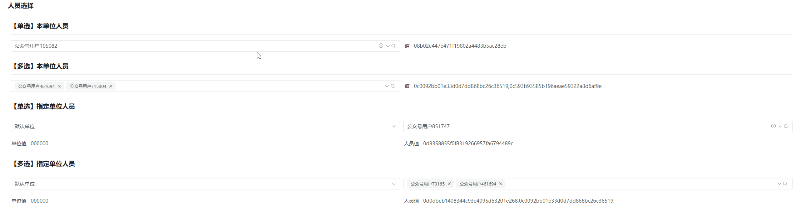
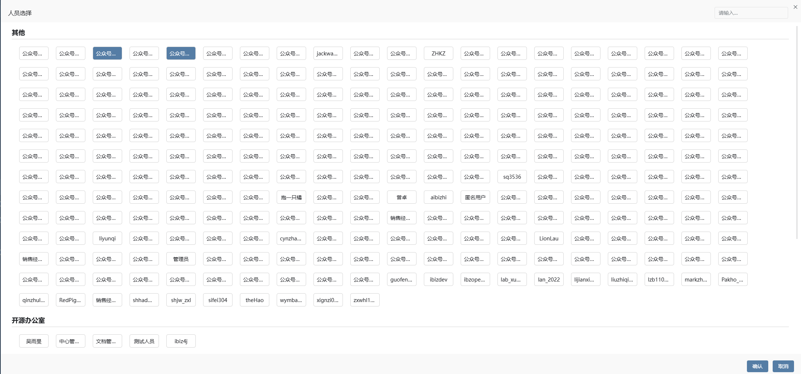

# 人员选择器

人员选择器通常用于为管理人员从某些部门或者单位中选择指定的人员。在组织或企业的管理系统中，根据配置的条件，人员选择器允许管理员或授权用户查看指定的部门或者单位中的所属人员，并允许对这些人员作出选择，以进行相关事务的安排。**隶属于编辑器插件（基于数据选择标准编辑器扩展）**





## 输入参数

| 属性名      | 描述                                                         | 类型                | 默认值                               |
| ----------- | ------------------------------------------------------------ | ------------------- | ------------------------------------ |
| url         | 人员列表的请求路径                                           | string              | —                                    |
| requestMode | 人员列表的请求方式                                           | get \| post         | get                                  |
| filter      | url中【指定字符串】替换为表单数据或上下文数据，表单数据优先，根据编辑器样式不同，指定的字符串也不同，详情见附录[详情表1](#filter详情表) | string              | —                                    |
| multiple    | 是否多选                                                     | boolean             | false                                |
| fillMap     | 填充对象，指定如何将选择的单位数据填入表单，由选中单位数据属性名称为键，填充表单属性名称为值组成的对象,（需要先配置值项） | object              | {id: 表单值项名称，name: 表单项名称} |
| inputMap    | 输入对象，指定请求响应数据如何处理成UI所需的数据结构，UI所需属性名称（id、label）为键，映射响应数据属性名称为值， | object              | { id: 'id',label: 'label', }         |
| treeurl     | 单位的请求地址，如果需要从所有的单位中选择人员，则需要配置该参数 | string              | —                                    |
| showMode    | 是否开启人员选择的复选框模式，该模式只适用于数据量较少的情况 | DEFAULT \| CHECKBOX | DEFAULT                              |

## 事件

| 事件名 | 说明               | 参数                                                        |
| ------ | ------------------ | ----------------------------------------------------------- |
| change | 人员数据值选中事件 | 2个参数，分别是当前选择的值, 当前容器项（eg：表单项）的名称 |

## 扩展插件

| 名称                     | 标识                  | 说明                                                         | 参数                                                         |
| ------------------------ | --------------------- | ------------------------------------------------------------ | ------------------------------------------------------------ |
| 【单选】人员（指定单位） | EMPSELECT             | 左边没有单位树，人员按照filter设置的单位id对应的表单项筛选，filter不设置默认按照当前登录人所属单位srforgid | url=/sysorganizations/${selected-orgid}/sysemployees/picker  |
| 【多选】人员（指定单位） | EMPMULTIPLE           | 左边没有单位树，人员按照filter设置的单位id对应的表单项筛选，filter不设置默认按照当前登录人所属单位srforgid | url=/sysorganizations/${selected-orgid}/sysemployees/picker  |

## 基本使用

在具体项目中，先通过模型导入编辑器插件、再导入编辑器样式，最后在具体的表单中选择对应的编辑器样式即可复用，其中编辑器插件和编辑器样式具体数据参见附录。

## 附录

### 编辑器插件

```
[
  {
    "plugintype": "EDITOR_CUSTOMSTYLE",
    "rtobjectrepo": "@ibiz-template-plugin/person-select@0.1.8-alpha.303",
    "codename": "UsrPFPlugin1212413268",
    "plugintag": "PERSONSELECT",
    "rtobjectmode": 2,
    "rtobjectname": "IBizPersonSelect",
    "pssyspfpluginname": "人员选择"
  }
]
```

### 编辑器样式

```json
[
  {
    "codename": "EMPMULTIPLE",
    "pssyspfpluginid": "UsrPFPlugin1212413268",
    "memo": "左边没有单位树，人员按照filter设置的单位id对应的表单项筛选，filter不设置默认按照当前登录人所属单位srforgid\nurl=/SYS_organizations/${selected-orgid}/SYS_employees/picker",
    "repdefault": 0,
    "validflag": 1,
    "pssyseditorstylename": "【多选】指定单位内人员选择",
    "ctrlparams": "filter=srforgid\nmultiple=true\nurl=/sysorganizations/${selected-orgid}/sysemployees/picker",
    "pseditortypeid": "PICKER"
  },
  {
    "codename": "EMPSELECT",
    "pssyspfpluginid": "UsrPFPlugin1212413268",
    "memo": "左边没有单位树，人员按照filter设置的单位id对应的表单项筛选，filter不设置默认按照当前登录人所属单位srforgid\nurl=/SYS_organizations/${selected-orgid}/SYS_employees/picker",
    "repdefault": 0,
    "validflag": 1,
    "pssyseditorstylename": "【单选】指定单位内人员选择",
    "ctrlparams": "filter=srforgid\nurl=/sysorganizations/${selected-orgid}/sysemployees/picker\nmultiple=false",
    "pseditortypeid": "PICKER"
  }
]

```

### filter详情表

| 扩展标识              | treeurl替换字符串 | url替换字符串     |
| --------------------- | ----------------- | ----------------- |
| EMPSELECT             | null              | ${selected-orgid} |
| EMPMULTIPLE           | null              | ${selected-orgid} |