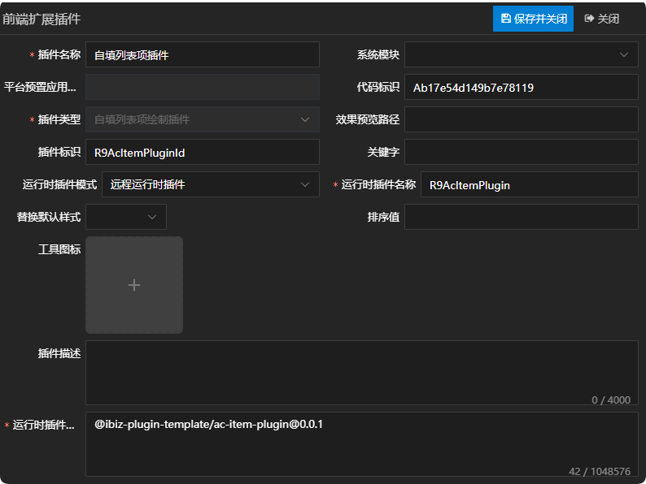
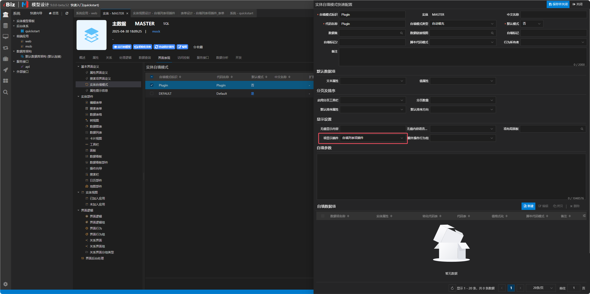
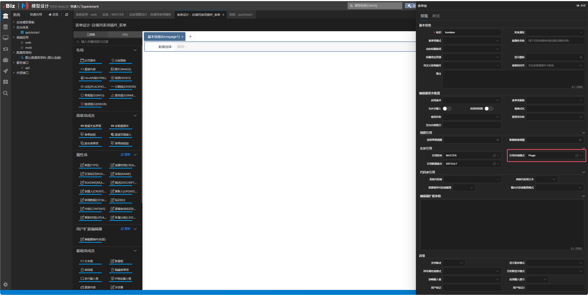
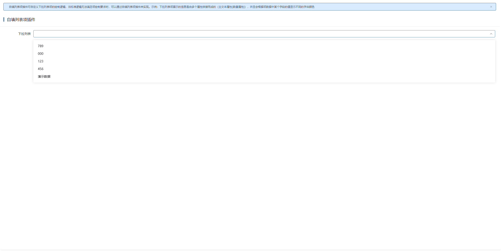
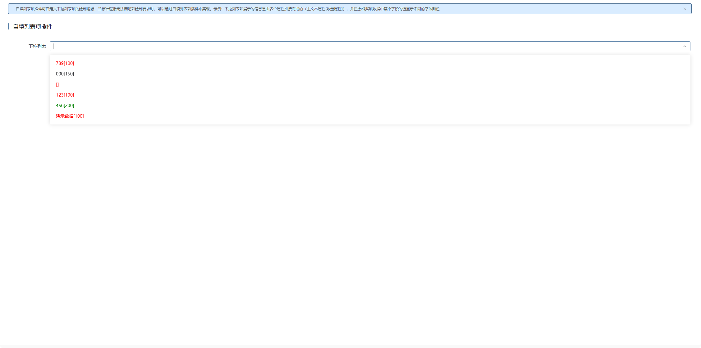

# 自填列表项插件

## 新建自填列表项绘制插件

新建自填列表项绘制插件，这儿唯一需要注意一点的是，运行时插件模式同时支持远程运行时插件，在实际运用的时候需根据当前项目所选择的插件模式来定义。详情参见 [运行时插件模式](./RUNTIME-PLUGIN-MODE.md) 篇。



## 在对应的实体自填模式上绑定插件



## 在对应的编辑器上绑定上一步配置的实体自填模式



## 插件机制

编辑器在绘制具体的项时，会先通过编辑器模型拿到对应的自填列表项适配器，若适配器存在，则绘制适配器component属性绑定的组件，否则根据编辑器内部逻辑进行绘制。详情如下：

```tsx
// 绘制自填列表项
const itemContent = (item: IData) => {
  const panel = this.c.deACMode?.itemLayoutPanel;
  const { context, params } = this.c;
  let selected = item[this.c.textName] || item.srfmajortext === this.curValue;
  if (this.c.valueItem) {
    selected =
      (item[this.c.keyName] || item.srfkey) === this.data[this.c.valueItem];
  }
  const className = [
    this.ns.is('active', selected),
    this.ns.e('transfer-item'),
  ];
  if (this.c.acItemProvider) {
    const component = resolveComponent(this.c.acItemProvider.component);
    return h(component, {
      item,
      controller: this.c,
      class: className,
      onClick: () => {
        this.onACSelect(item);
      },
    });
  }
  return panel ? (
    <iBizControlShell
      data={item}
      class={className}
      modelData={panel}
      context={context}
      params={params}
      onClick={() => {
        this.onACSelect(item);
      }}
    ></iBizControlShell>
  ) : (
    <div
      class={[this.ns.is('ellipsis', isEllipsis), ...className]}
      title={showTitle(isEllipsis ? item[this.c.textName] : '')}
      onClick={() => {
        this.onACSelect(item);
      }}
    >
      {item[this.c.textName]}
    </div>
  );
};
```

## 插件示例

### 插件效果

#### 使用插件前



#### 使用插件后



### 插件结构

```
|─ ─ ac-item-plugin                         自填列表项插件顶层目录，可根据实际业务命名
  |─ ─ src                                  自填列表项插件源代码目录
​    |─ ─ ac-item-plugin.provider.ts         自填列表项插件适配器
​    |─ ─ ac-item-plugin.scss                自填列表项插件样式
​    |─ ─ ac-item-plugin.tsx                 自填列表项插件组件
​    |─ ─ index.ts                           自填列表项插件入口文件
```

### 自填列表项插件入口文件

自填列表项插件入口文件会全局注册自填列表项插件适配器和自填列表项插件组件，供外部使用。

```typescript
/* eslint-disable @typescript-eslint/explicit-module-boundary-types */
/* eslint-disable @typescript-eslint/explicit-function-return-type */
import { App } from 'vue';
import { registerAcItemProvider } from '@ibiz-template/runtime';
import { AcItemPlugin } from './ac-item-plugin';
import { AcItemPluginProvider } from './ac-item-plugin.provider';

export default {
  install(app: App) {
    // 全局注册自填列表项插件组件
    app.component(AcItemPlugin.name!, AcItemPlugin);
    // 全局注册自填列表项插件适配器，AC_ITEM是插件类型，R9AcItemPluginId是插件标识
    registerAcItemProvider(
      'AC_ITEM_R9AcItemPluginId',
      () => new AcItemPluginProvider(),
    );
  },
};
```

### 自填列表项插件组件

自填列表项插件组件使用tsx的书写方式，承载自填列表项绘制的内容，可根据需求自定义内容呈现。

### 自填列表项插件适配器

自填列表项插件适配器主要通过component属性指定自填列表项实际要绘制的组件。

## 本地开发

1. 安装依赖并link至全局

```sh
// 安装依赖
pnpm i

// 启动
pnpm dev

// link到全局
pnpm link --global
```

2. 主项目包中引用插件

```sh
// link插件
pnpm link --global '@ibiz-plugin-template/ac-item-plugin'
```

3. 主项目包中注册插件

```ts
import { App } from 'vue';
import AcItemPlugin from '@ibiz-plugin-template/ac-item-plugin';

export default {
  install(app: App): void {
    app.use(AcItemPlugin);
    // 设置本地开发需要忽略加载的插件，可填写正则或全匹配字符串。匹配插件在modeling建模平台配置的[运行时插件仓库配置]内容
    ibiz.plugin.setDevIgnore(/^@ibiz-plugin-template\/ac-item-plugin/);
  },
};
```
