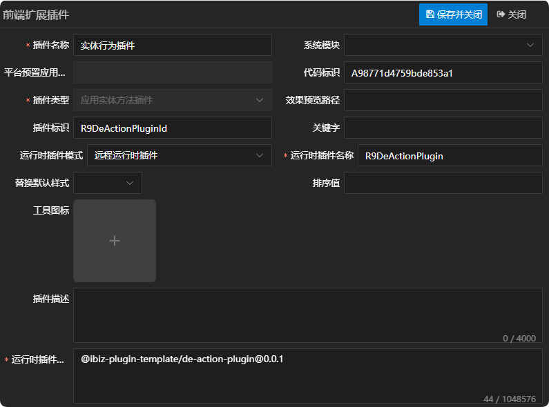
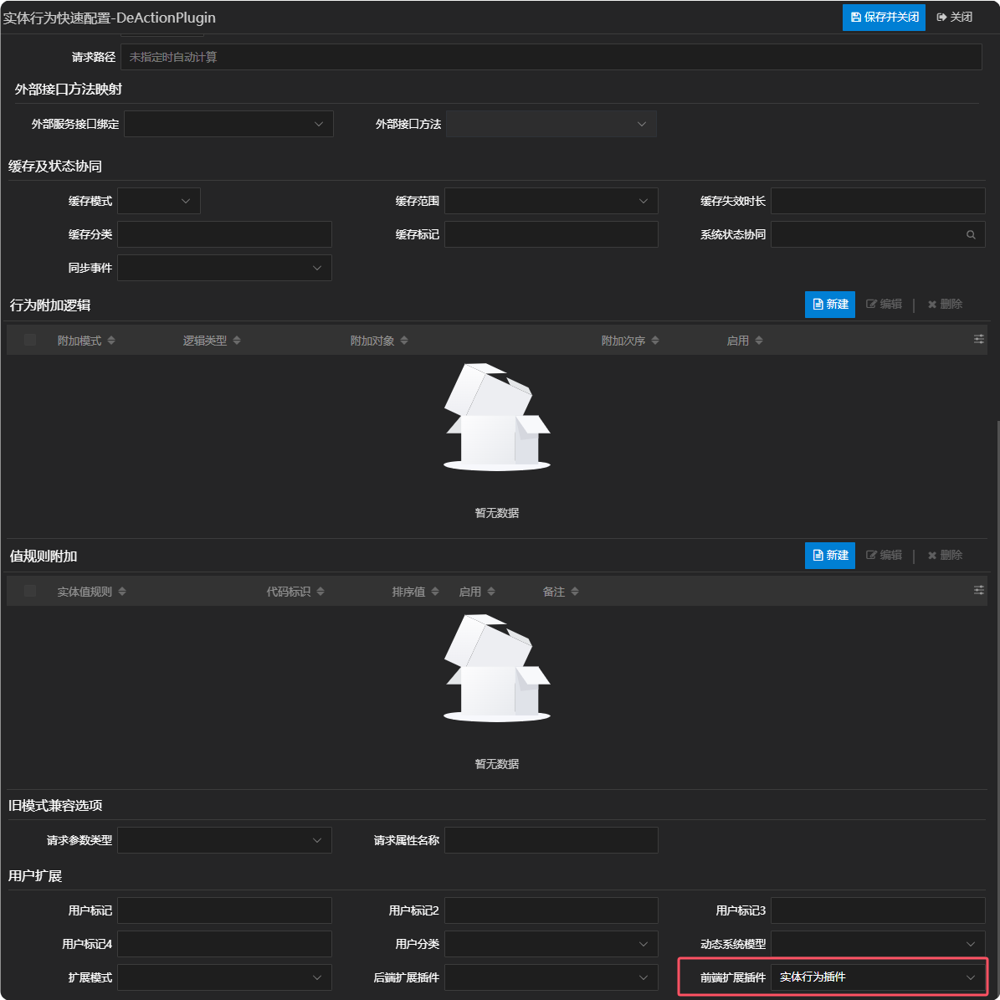
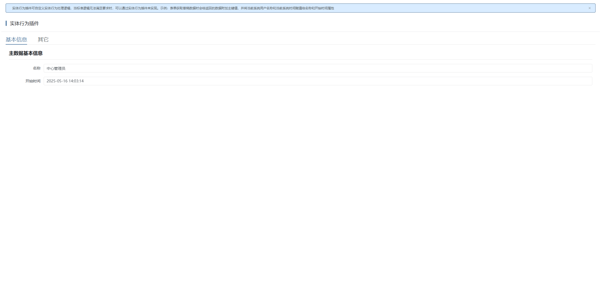

# 实体行为插件

## 新建应用实体方法插件

新建应用实体方法插件，这儿唯一需要注意一点的是，运行时插件模式同时支持远程运行时插件，在实际运用的时候需根据当前项目所选择的插件模式来定义。详情参见 [运行时插件模式](./RUNTIME-PLUGIN-MODE.md) 篇。



## 在对应的实体行为上绑定插件



## 插件机制

执行服务方法时，会通过实体获取对应的实体服务，然后再执行实体服务的exec方法。实体服务内部会通过模型获取对应的实体行为适配器，然后调用实体行为适配器的create方法获取实体服务方法实例。详情如下：

```tsx
// 获取对应的实体服务，然后再执行实体服务的exec方法
async exec(
  appDataEntityId: string,
  methodName: string,
  context: IContext,
  params?: IData | IData[] | undefined,
  params2?: IParams | undefined,
  header?: IData,
): Promise<IHttpResponse<IData>> {
  // 优先处理开启应用实体服务映射情况
  const { targetApp, targetAppDataEntityId } =
    await this.computeAppDEMappingParam(context, appDataEntityId);
  if (targetApp && targetAppDataEntityId) {
    const result = await targetApp.deService.exec(
      targetAppDataEntityId,
      methodName,
      context,
      params,
      params2,
      header,
    );
    return result;
  }
  // 标准逻辑
  const service = await this.getService(context, appDataEntityId);
  const result = await service.exec(
    methodName,
    context,
    params,
    params2,
    header,
  );
  return result;
}

// 获取对应的实体行为适配器，然后调用实体行为适配器的create方法获取实体服务方法实例
async getMethod(
  id: string,
  acMode: boolean = false,
): Promise<Method> {
  const cacheId = acMode ? `ac-${id}` : id;
  if (this.methodMap.has(cacheId)) {
    return this.methodMap.get(cacheId)!;
  }
  const model = findAppDEMethod(this.model, id) as IAppDEMethod;

  if (!model) {
    throw new RuntimeModelError(
      this.model,
      ibiz.i18n.t('runtime.service.noFoundServiceMethod', { id }),
    );
  }

  // 获取适配器
  const provider = await getDEMethodProvider(model);
  if (!provider) {
    throw new ModelError(
      model,
      ibiz.i18n.t('runtime.service.UnsupportedServiceMethod', {
        methodType: model.methodType,
      }),
    );
  }
  const method: Method = provider.create(this, this.model, model, {
    acMode,
    localMode: this.isLocalMode,
  });
  this.methodMap.set(cacheId, method);
  return method;
}
```

## 插件示例

### 插件效果

表单获取草稿数据时会给返回的数据附加主键值，并将当前系统用户名称和当前系统时间赋值给名称和开始时间属性



### 插件结构

```
|─ ─ de-action-plugin                         实体行为插件顶层目录，可根据实际业务命名
  |─ ─ src                                    实体行为插件源代码目录
​    |─ ─ de-action-plugin.provider.ts         实体行为插件适配器
​    |─ ─ de-action-plugin.ts                  实体行为插件实现类
​    |─ ─ index.ts                             实体行为插件入口文件
```

### 实体行为插件入口文件

实体行为插件入口文件会全局注册实体行为插件适配器，供外部使用。

```typescript
import { App } from 'vue';
import { registerDEMethodProvider } from '@ibiz-template/runtime';
import { DeActionPluginProvider } from './de-action-plugin.provider';

export default {
  install(_app: App) {
    // 全局注册实体行为插件适配器, DEMETHOD是插件类型，R9DeActionPluginId是插件标识
    registerDEMethodProvider(
      'DEMETHOD_R9DeActionPluginId',
      () => new DeActionPluginProvider(),
    );
  },
};
```

### 实体行为插件实现类

实体行为插件实现类可继承基础应用方法Method，重写部分逻辑。

### 实体行为插件适配器

实体行为插件适配器的create方法返回实体行为插件实现类的实例。

## 本地开发

1. 安装依赖并link至全局

```sh
// 安装依赖
pnpm i

// 启动
pnpm dev

// link到全局
pnpm link --global
```

2. 主项目包中引用插件

```sh
// link插件
pnpm link --global '@ibiz-plugin-template/de-action-plugin'
```

3. 主项目包中注册插件

```ts
import { App } from 'vue';
import DeActionPlugin from '@ibiz-plugin-template/de-action-plugin';

export default {
  install(app: App): void {
    app.use(DeActionPlugin);
    // 设置本地开发需要忽略加载的插件，可填写正则或全匹配字符串。匹配插件在modeling建模平台配置的[运行时插件仓库配置]内容
    ibiz.plugin.setDevIgnore(/^@ibiz-plugin-template\/de-action-plugin/);
  },
};
```
