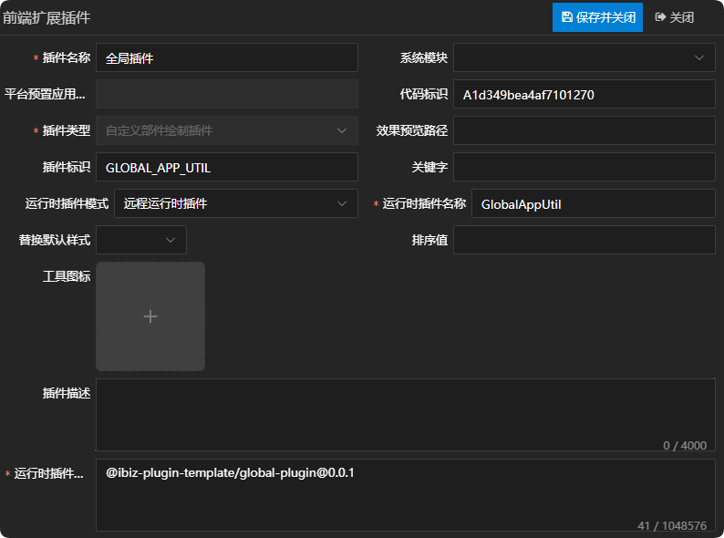
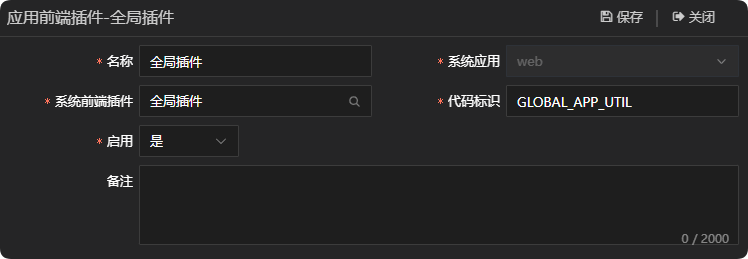
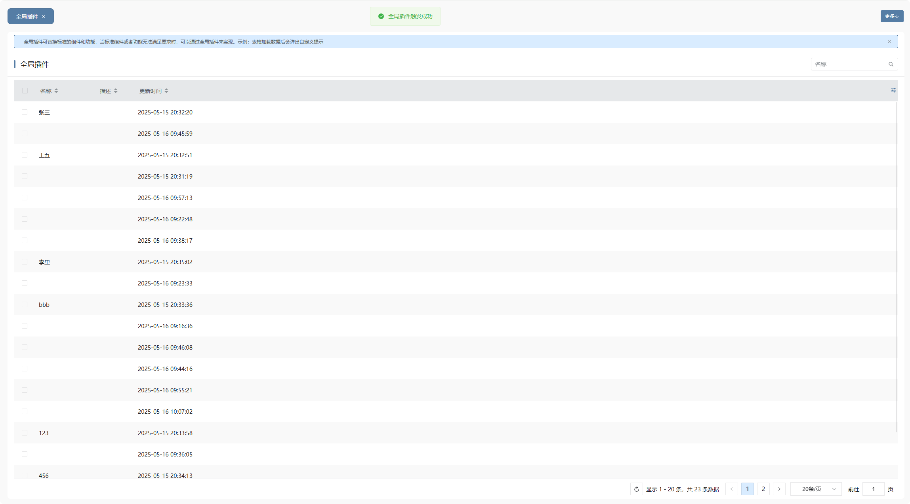

# 全局插件

当前全局插件处于关闭状态。若要应用全局插件，需先将全局插件入口文件中被注释的逻辑代码还原，随后在配置平台里启用应用插件。

## 新建自定义部件绘制插件

新建自定义部件绘制插件，需要注意的是插件标识需设置为GLOBAL_APP_UTIL，除此之外，运行时插件模式同时支持远程运行时插件，在实际运用的时候需根据当前项目所选择的插件模式来定义。详情参见 [运行时插件模式](./RUNTIME-PLUGIN-MODE.md) 篇。



## 新建应用插件，并绑定上一步创建的自定义部件绘制插件

需要注意的是代码标识需设置为GLOBAL_APP_UTIL。



## 插件机制

应用初始化的时候，如果应用配置了应用插件，则会去加载应用插件，然后替换标准的组件和功能，详情如下：

```tsx
// 加载应用插件
async loadGlobalAppUtil(): Promise<void> {
  const appUtilTag: string = 'GLOBAL_APP_UTIL';
  const globalAppUtilPlugin = ibiz.hub.getPlugin(
    appUtilTag.toLowerCase(),
    this.appId,
  );
  if (!globalAppUtilPlugin) return;
  if (
    globalAppUtilPlugin.refMode !== 'APP' ||
    globalAppUtilPlugin.refTag !== appUtilTag
  )
    return;
  await ibiz.plugin.loadPlugin(globalAppUtilPlugin as ISysPFPlugin);
}
```

## 插件示例

### 插件效果

表格加载数据后会弹出自定义提示



### 插件结构

```
|─ ─ global-plugin                         全局插件顶层目录，可根据实际业务命名
  |─ ─ src                                 全局插件源代码目录
​    |─ ─ grid-view-engine.ts               表格视图引擎
    |─ ─ index.scss                        全局插件样式
​    |─ ─ index.ts                          全局插件入口文件
```

### 全局插件入口文件

全局插件入口文件会换标准的组件和功能，供外部使用。

```typescript
import { App } from 'vue';
import { IViewController } from '@ibiz-template/runtime';
import { GridViewEngine } from './grid-view-engine';
import './index.scss';

export default {
  install(_app: App) {
    // 替换标准的表格视图引擎
    ibiz.engine.register(
      'VIEW_GridView',
      (c: IViewController) => new GridViewEngine(c),
    );
  },
};
```

## 本地开发

1. 安装依赖并link至全局

```sh
// 安装依赖
pnpm i

// 启动
pnpm dev

// link到全局
pnpm link --global
```

2. 主项目包中引用插件

```sh
// link插件
pnpm link --global '@ibiz-plugin-template/global-plugin'
```

3. 主项目包中注册插件

```ts
import { App } from 'vue';
import GlobalPlugin from '@ibiz-plugin-template/global-plugin';

export default {
  install(app: App): void {
    app.use(GlobalPlugin);
    // 设置本地开发需要忽略加载的插件，可填写正则或全匹配字符串。匹配插件在modeling建模平台配置的[运行时插件仓库配置]内容
    ibiz.plugin.setDevIgnore(/^@ibiz-plugin-template\/global-plugin/);
  },
};
```
