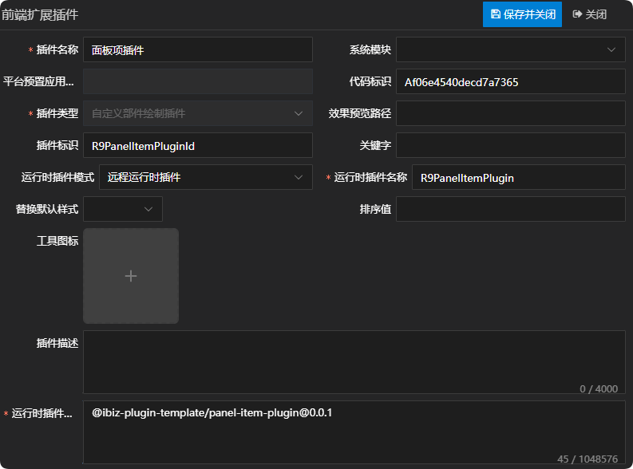
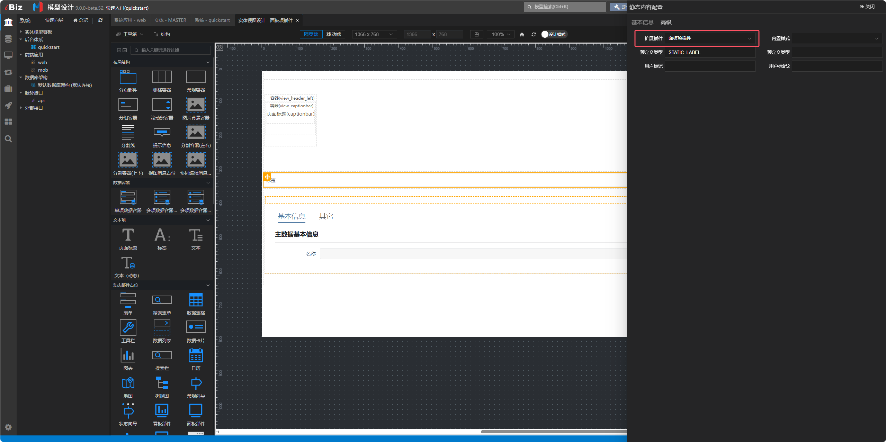
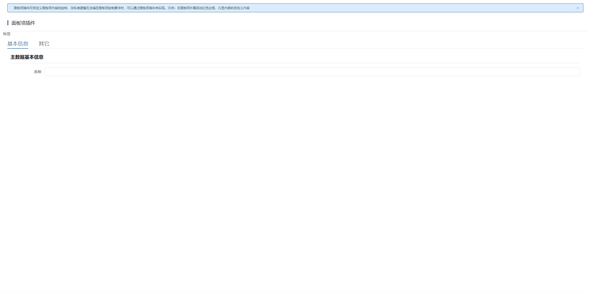
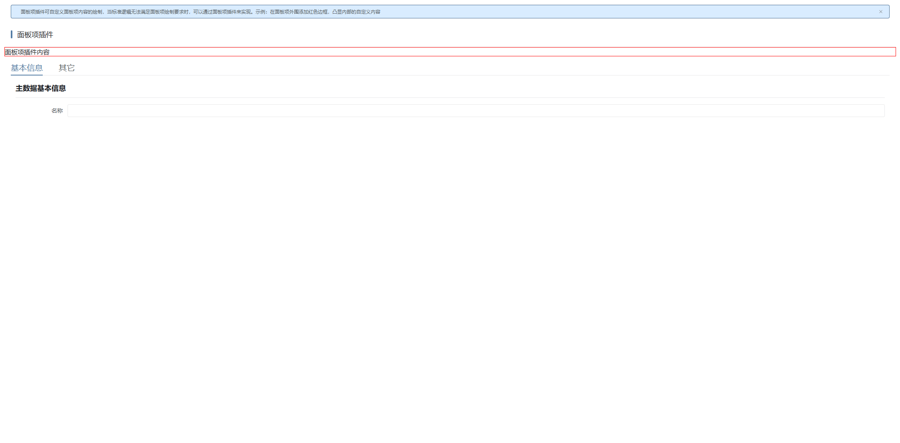

# 面板项插件

## 新建自定义部件绘制插件

新建自定义部件绘制插件，这儿唯一需要注意一点的是，运行时插件模式同时支持远程运行时插件，在实际运用的时候需根据当前项目所选择的插件模式来定义。详情参见 [运行时插件模式](./RUNTIME-PLUGIN-MODE.md) 篇。



## 在对应的面板项上绑定插件



## 插件机制

视图在绘制面板项时，是通过面板项适配器上的component属性去获取组件名称，然后进行绘制的，并且渲染时会将createController方法返回的控制器传给对应的面板项组件。如只需修改控制器逻辑但不改变UI呈现，可直接通过createController方法返回新的控制器即可。详情如下：

```tsx
// 绘制面板项
const renderPanelItem = (
  panelItem: IPanelItem,
  options?: {
    providers: {
      [key: string]: IPanelItemProvider;
    };
    panelItems: {
      [key: string]: IPanelItemController;
    };
  },
): VNode | null => {
  if ((panelItem as IPanelField).hidden) {
    return null;
  }
  const { providers, panelItems } = options || c;
  const provider = providers[panelItem.id!];
  if (!provider) {
    return (
      <div>
        {ibiz.i18n.t('vue3Util.control.unsupportedPanel', {
          id: panelItem.id,
          itemType: panelItem.itemType,
        })}
      </div>
    );
  }
  // 面板项插槽，排除部件占位
  if (panelItem.itemType !== 'CTRLPOS' && slots[panelItem.id!]) {
    return renderSlot(slots, panelItem.id!, {
      model: panelItem,
      data: c.data,
      value: c.data[panelItem.id!],
    });
  }
  const component = resolveComponent(provider.component);
  // eslint-disable-next-line @typescript-eslint/no-explicit-any
  let children: any;
  // 占位类型成员填充外部对应的插槽。
  if (panelItem.itemType === 'CTRLPOS' && slots[panelItem.id!]) {
    const panelItemC = panelItems[panelItem.id!]!;
    if (panelItemC.parent && isSimpleDataContainer(panelItemC.parent.model)) {
      children = () => {
        return slots[panelItem.id!]!({
          isSimple: true,
          data: panelItemC.data,
        });
      };
    } else {
      children = () => slots[panelItem.id!]!();
    }
  } else if (
    panelItem.itemType === 'TABPANEL' &&
    (panelItem as IPanelTabPanel).panelTabPages?.length
  ) {
    children = () => {
      return (panelItem as IPanelTabPanel).panelTabPages!.map(child => {
        return renderPanelItem(child, options);
      });
    };
  } else if (isDataContainer(panelItem)) {
    // 单项数据容器，多项数据容器不给子
    children = undefined;
  } else if ((panelItem as IPanelContainer).panelItems?.length) {
    children = () => {
      return (panelItem as IPanelContainer).panelItems!.map(child => {
        return renderPanelItem(child, options);
      });
    };
  }

  // 直接样式
  let tempStyle = '';
  if (panelItem.cssStyle) {
    tempStyle = panelItem.cssStyle;
  }
  const panelItemC = panelItems[panelItem.id!]!;
  return h(
    component,
    {
      modelData: panelItem,
      controller: panelItemC,
      key: panelItem.id,
      style: tempStyle,
      attrs: renderAttrs(panelItem, panelItemC),
    },
    children,
  );
};
```

## 插件示例

### 插件效果

#### 使用插件前



#### 使用插件后



### 插件结构

```
|─ ─ panel-item-plugin                         面板项插件顶层目录，可根据实际业务命名
  |─ ─ src                                     面板项插件源代码目录
​    |─ ─ panel-item-plugin.controller.ts       面板项插件控制器
​    |─ ─ panel-item-plugin.provider.ts         面板项插件适配器
​    |─ ─ panel-item-plugin.scss                面板项插件样式
​    |─ ─ panel-item-plugin.tsx                 面板项插件组件
​    |─ ─ index.ts                              面板项插件入口文件
```

### 面板项插件入口文件

面板项插件入口文件会全局注册面板项插件适配器和面板项插件组件，供外部使用。

```typescript
import { registerPanelItemProvider } from '@ibiz-template/runtime';
import { App } from 'vue';
import { PanelItemPlugin } from './panel-item-plugin';
import { PanelItemPluginProvider } from './panel-item-plugin.provider';

export default {
  install(app: App) {
    // 全局注册面板项插件组件
    app.component(PanelItemPlugin.name!, PanelItemPlugin);
    // 全局注册面板项插件适配器，CUSTOM是插件类型，R9PanelItemPluginId是插件标识
    registerPanelItemProvider(
      'CUSTOM_R9PanelItemPluginId',
      () => new PanelItemPluginProvider(),
    );
  },
};
```

### 面板项插件组件

面板项插件组件使用tsx的书写方式，承载面板项绘制的内容，可拷贝基础UI绘制，然后根据需求进行调整。其中，基础UI绘制可参考附录中UI呈现部分。

### 面板项插件适配器

面板项插件适配器主要通过component属性指定面板项实际要绘制的组件，并且通过createController方法返回需传递给面板项的控制器。

### 面板项插件控制器

面板项插件控制器可继承基础控制器，然后根据需求进行调整。其中，基础控制器可参考附录中控制器部分。

## 本地开发

1. 安装依赖并link至全局

```sh
// 安装依赖
pnpm i

// 启动
pnpm dev

// link到全局
pnpm link --global
```

2. 主项目包中引用插件

```sh
// link插件
pnpm link --global '@ibiz-plugin-template/panel-item-plugin'
```

3. 主项目包中注册插件

```ts
import { App } from 'vue';
import PanelItemPlugin from '@ibiz-plugin-template/panel-item-plugin';

export default {
  install(app: App): void {
    app.use(PanelItemPlugin);
    // 设置本地开发需要忽略加载的插件，可填写正则或全匹配字符串。匹配插件在modeling建模平台配置的[运行时插件仓库配置]内容
    ibiz.plugin.setDevIgnore(/^@ibiz-plugin-template\/panel-item-plugin/);
  },
};
```

## 附录

|          面板项          |        UI呈现         |             控制器              |
| :----------------------: | :-------------------: | :-----------------------------: |
|        应用切换器        |       AppSwitch       |       AppSwitchController       |
|       人机识别控件       |      AuthCaptcha      |      AuthCaptchaController      |
|        第三方登录        |        AuthSso        |       PanelItemController       |
|         用户信息         |     AuthUserinfo      |       PanelItemController       |
|     协同编辑消息占位     |        CoopPos        |        CoopPosController        |
|         数据导入         |    DataImportShell    |       PanelItemController       |
|         全局搜索         |     GlobalSearch      |     GlobalSearchController      |
|       首页行为容器       |     IndexActions      |    PanelContainerController     |
|       首页空白占位       | IndexBlankPlaceholder | IndexBlankPlaceholderController |
|        面包屑导航        |     NavBreadcrumb     |     NavBreadcrumbController     |
|        导航区占位        |      NavPosIndex      |      NavPosIndexController      |
|       标签页导航栏       |        NavTabs        |        NavTabsController        |
|   面板容器（应用头部）   |    PanelAppHeader     |       PanelItemController       |
| 面板容器（应用登录视图） |   PanelAppLoginView   |   PanelAppLoginViewController   |
|         应用标题         |     PanelAppTitle     |     PanelAppTitleController     |
|         面板按钮         |      PanelButton      |      PanelButtonController      |
|        面板按钮组        |    PanelButtonList    |    PanelButtonListController    |
| 面板容器（导航部件头部） |    PanelExpHeader     |       PanelItemController       |
|         首页搜索         | PanelIndexViewSearch  |       PanelItemController       |
|         记住登陆         |    PanelRememberMe    |    PanelRememberMeController    |
|          轮播图          |  PanelStaticCarousel  |       PanelItemController       |
|         分页面板         |     PanelTabPanel     |     PanelTabPanelController     |
|   面板容器（视图内容）   |   PanelViewContent    |       PanelItemController       |
|   面板容器（视图头部）   |    PanelViewHeader    |       PanelItemController       |
|       搜索表单按钮       |   SearchFormButtons   |   SearchFormButtonsController   |
|         快捷操作         |       ShortCut        |       PanelItemController       |
|         分割容器         |    SplitContainer     |    SplitContainerController     |
|         用户操作         |      UserAction       |       PanelItemController       |
|         用户消息         |      UserMessage      |       PanelItemController       |
|         视图消息         |      ViewMessage      |       PanelItemController       |
|       视图消息占位       |      ViewMsgPos       |      ViewMsgPosController       |
