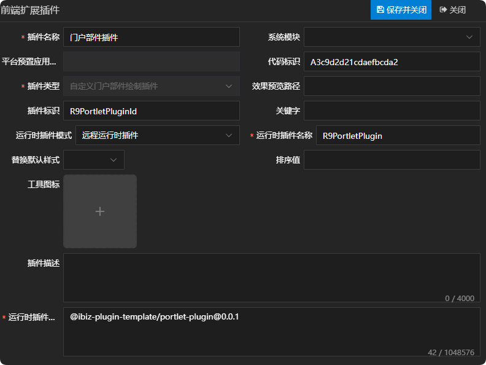
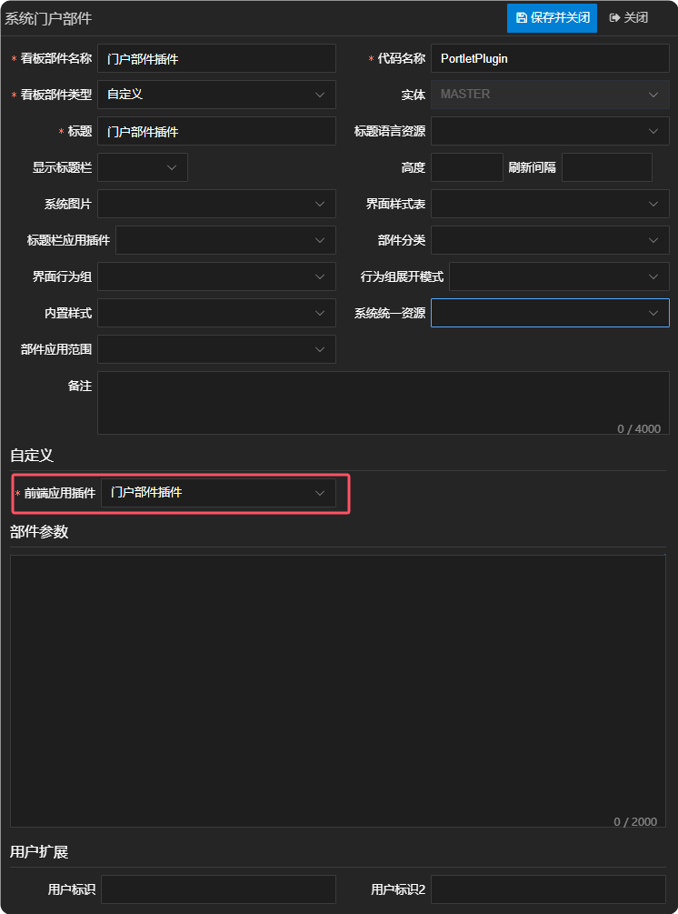

# 门户部件插件

## 新建自定义门户部件绘制插件

新建自定义门户部件绘制插件，这儿唯一需要注意一点的是，运行时插件模式同时支持远程运行时插件，在实际运用的时候需根据当前项目所选择的插件模式来定义。详情参见 [运行时插件模式](./RUNTIME-PLUGIN-MODE.md) 篇。



## 在对应的门户部件上绑定插件



## 插件机制

看板在绘制门户部件时，是通过门户部件适配器上的component属性去获取组件名称，然后进行绘制的，并且渲染时会将createController方法返回的控制器传给对应的门户部件组件。如只需修改控制器逻辑但不改变UI呈现，可直接通过createController方法返回新的控制器即可。详情如下：

```tsx
// 绘制门户部件
function renderPortletByType(
  model: IDBPortletPart,
  c: DashboardController,
  opts?: IData,
): VNode {
  const provider = c.providers[model.id!];
  const controller = c.portlets[model.id!];
  const commonProps = {
    modelData: model,
    controller,
  };

  if (!provider) {
    return (
      <div>
        {model.portletType}
        {ibiz.i18n.t('app.noSupport')}
      </div>
    );
  }

  const providerComp = resolveComponent(
    provider.component,
  ) as ConcreteComponent;
  // 绘制容器
  if (model.portletType === 'CONTAINER') {
    const container = model as IDBContainerPortletPart;
    return h(
      providerComp,
      {
        ...commonProps,
        key: model.id,
        id: model.id,
      },
      {
        default: () =>
          container.controls?.map(child => renderPortletByType(child, c, opts)),
      },
    );
  }

  // 绘制门户部件
  return h(providerComp, {
    ...commonProps,
    key: refreshTagObj[model.id!]?.refreshtag
      ? refreshTagObj[model.id!].refreshtag
      : model.id,
    id: model.id,
  });
}
```

## 插件示例

### 插件效果

#### 使用插件前


#### 使用插件后


### 插件结构

```
|─ ─ portlet-plugin                         门户部件插件顶层目录，可根据实际业务命名
  |─ ─ src                                  门户部件插件源代码目录
​    |─ ─ portlet-plugin.controller.ts       门户部件插件控制器
​    |─ ─ portlet-plugin.provider.ts         门户部件插件适配器
​    |─ ─ portlet-plugin.scss                门户部件插件样式
​    |─ ─ portlet-plugin.tsx                 门户部件插件组件
​    |─ ─ index.ts                           门户部件插件入口文件
```

### 门户部件插件入口文件

门户部件插件入口文件会全局注册门户部件插件适配器和门户部件插件组件，供外部使用。

```typescript
import { App } from 'vue';
import { registerPortletProvider } from '@ibiz-template/runtime';
import { PortletPlugin } from './portlet-plugin';
import { PortletPluginProvider } from './portlet-plugin.provider';

export default {
  install(app: App) {
    // 全局注册门户部件插件组件
    app.component(PortletPlugin.name!, PortletPlugin);
    // 全局注册门户部件插件适配器，PORTLET_CUSTOM是插件类型，R9PortletPluginId是插件标识
    registerPortletProvider(
      'PORTLET_CUSTOM_R9PortletPluginId',
      () => new PortletPluginProvider(),
    );
  },
};
```

### 门户部件插件组件

门户部件插件组件使用tsx的书写方式，承载门户部件绘制的内容，可拷贝基础UI绘制，然后根据需求进行调整。其中，基础UI绘制可参考附录中UI呈现部分。

### 门户部件插件适配器

门户部件插件适配器主要通过component属性指定门户部件实际要绘制的组件，并且通过createController方法返回需传递给门户部件的控制器。

### 门户部件插件控制器

门户部件插件控制器可继承基础控制器，然后根据需求进行调整。其中，基础控制器可参考附录中控制器部分。

## 本地开发

1. 安装依赖并link至全局

```sh
// 安装依赖
pnpm i

// 启动
pnpm dev

// link到全局
pnpm link --global
```

2. 主项目包中引用插件

```sh
// link插件
pnpm link --global '@ibiz-plugin-template/portlet-plugin'
```

3. 主项目包中注册插件

```ts
import { App } from 'vue';
import PortletPlugin from '@ibiz-plugin-template/portlet-plugin';

export default {
  install(app: App): void {
    app.use(PortletPlugin);
    // 设置本地开发需要忽略加载的插件，可填写正则或全匹配字符串。匹配插件在modeling建模平台配置的[运行时插件仓库配置]内容
    ibiz.plugin.setDevIgnore(/^@ibiz-plugin-template\/portlet-plugin/);
  },
};
```

## 附录

| 门户部件类型 |      UI呈现      |           控制器           |
| :----------: | :--------------: | :------------------------: |
|    操作栏    | ActionBarPortlet | ActionBarPortletController |
|   实体图表   |   ChartPortlet   |   ChartPortletController   |
|     容器     | ContainerPortlet | ContainerPortletController |
|    过滤器    |  FilterPortlet   |  FilterPortletController   |
|   网页部件   |   HtmlPortlet    |   HtmlPortletController    |
|   实体列表   |   ListPortlet    |   ListPortletController    |
|    菜单栏    |   MenuPortlet    |   MenuPortletController    |
|   直接内容   |  RawItemPortlet  |  RawItemPortletController  |
|     报表     |  ReportPortlet   |  ReportPortletController   |
|   系统视图   |   ViewPortlet    |   ViewPortletController    |
