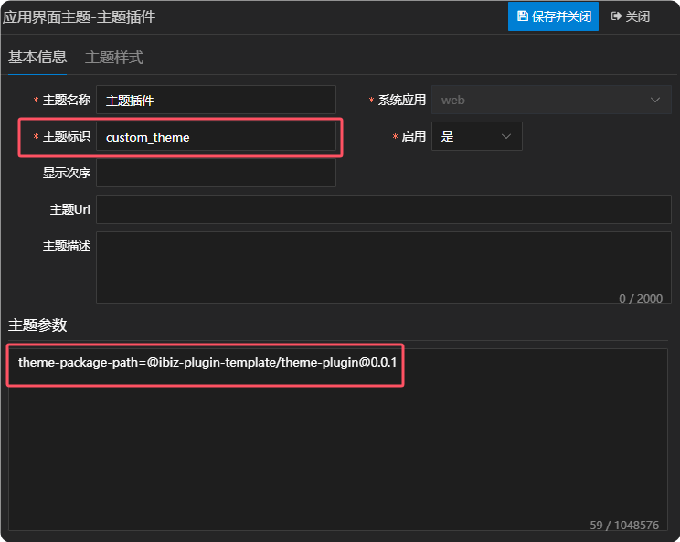
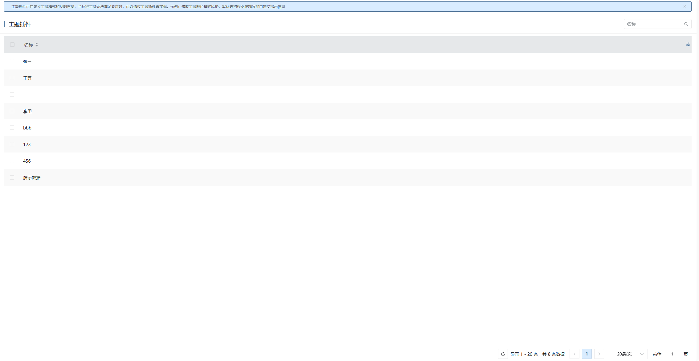
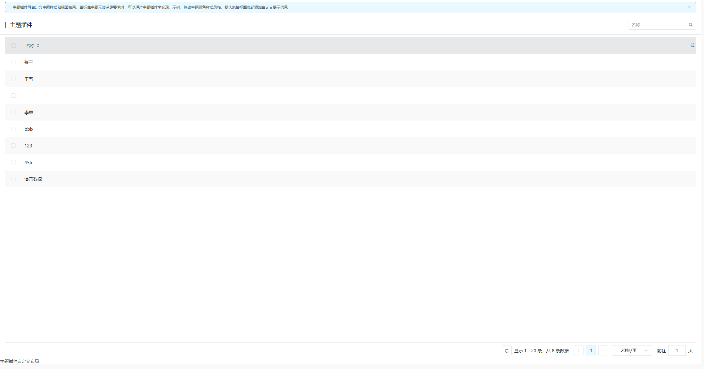

# 主题插件

当前主题插件处于关闭状态。若要应用主题插件，需先将主题插件入口文件中被注释的逻辑代码还原，随后在配置平台里启用主题。

## 新建主题

新建界面主题，需要注意的是主题标识需要和主题插件包中的主题class类名一致，并且配置主题参数theme-package-path，主题参数的值是主题插件包信息。



## 插件机制

应用初始化的时候，如果应用配置了主题，则会加载其对应的主题包插件，从而应用自定义主题样式和覆盖指定的默认视图布局，详情如下：

```typescript
async initModel(context: IParams, permission: boolean = true): Promise<void> {
  // 没初始化或者初始化了但是切换模型
  if (
    !this.hasModelInit ||
    (this.hasModelInit && this.noPermissionModel !== permission)
  ) {
    // 清空重置基座
    ibiz.hub.reset();
    const helper = new ModelHelper(
      async (url: string, params?: IParams) => {
        const res = await ibiz.net.get(
          `${ibiz.env.remoteModelUrl}${url}`,
          params,
          permission ? {} : { srfdcsystem: ibiz.env.dcSystem },
        );
        return res.data;
      },
      ibiz.env.appId,
      context,
      permission,
    );
    const tempApp = await helper.getAppModel();
    await this.initEnvironment(tempApp);
    const app = await ibiz.hub.getAppAsync(ibiz.env.appId);
    await AppHooks.initedApp.call({ context, app });
    const appModel = app.model;
    ibiz.env.isMob = appModel.mobileApp === true;
    if (ibiz.env.isEnableMultiLan) {
      const lang = ibiz.i18n.getLang();
      const m = await helper.getPSAppLang(
        lang.replace('-', '_').toUpperCase(),
      );
      const items = m.languageItems || [];
      // eslint-disable-next-line @typescript-eslint/no-explicit-any
      const data: any = {};
      items.forEach(item => {
        data[item.lanResTag!] = item.content;
      });
      i18n.global.mergeLocaleMessage(lang, data);
    }
    const module = await import('@ibiz-template/web-theme');
    const theme = module.default || module;
    AppHooks.useComponent.callSync(null, theme);
    if (ibiz.config.theme) ibiz.util.theme.setTheme(ibiz.config.theme);
    if (appModel.appUIThemes) {
      await this.loadTheme();
    }

    // 设置浏览器标题
    if (app.model.title) {
      ibiz.util.setBrowserTitle('');
    }
  }

  this.noPermissionModel = permission;
  this.hasModelInit = true;
  }
```

## 插件示例

### 插件效果

#### 使用插件前



#### 使用插件后



### 插件结构

```
|─ ─ theme-plugin                              主题插件顶层目录，可根据实际业务命名
  |─ ─ src                                     主题插件源代码目录
​    |─ ─ layout                                布局目录
      |─ ─ de-grid-view-layout.ts              默认表格视图布局json
      |─ ─ index.ts                            布局入口文件
    |─ ─ theme                                 主题目录
      |─ ─ custom-theme.scss                   自定义主题
      |─ ─ index.ts                            主题入口文件
​    |─ ─ index.ts                              主题插件入口文件
```

### 主题插件入口文件

主题插件入口文件会加载自定义主题样式，并且覆盖指定的默认视图布局，供外部使用。

```typescript
import WebTheme from '@ibiz-template/web-theme';
import { install } from './layout';
import './theme/index.scss';

export default {
  install(): void {
    // 安装默认主题
    WebTheme.install();
    // 覆盖默认视图布局
    install((key: string, model: any) => {
      ibiz.util.layoutPanel.register(key, model);
    });
  },
};
```

### 布局入口文件

布局入口文件会覆盖指定的默认视图布局，可以重新定义默认视图布局的json结构。

### 主题入口文件

主题入口文件会加载自定义主题样式。

## 本地开发

1. 安装依赖并link至全局

```sh
// 安装依赖
pnpm i

// 启动
pnpm dev

// link到全局
pnpm link --global
```

2. 主项目包中引用插件

```sh
// link插件
pnpm link --global '@ibiz-plugin-template/theme-plugin'
```

3. 主项目包中注册插件

```ts
import { App } from 'vue';
import ThemePlugin from '@ibiz-plugin-template/theme-plugin';

export default {
  install(app: App): void {
    app.use(ThemePlugin);
    // 设置本地开发需要忽略加载的插件，可填写正则或全匹配字符串。匹配插件在modeling建模平台配置的[运行时插件仓库配置]内容
    ibiz.plugin.setDevIgnore(/^@ibiz-plugin-template\/theme-plugin/);
  },
};
```
