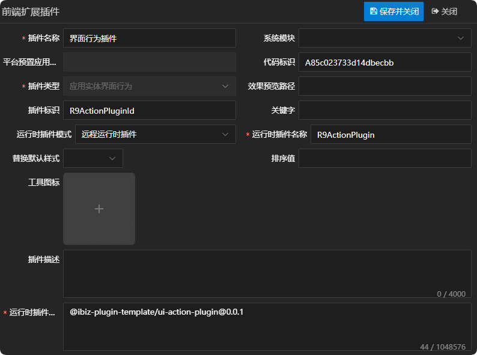
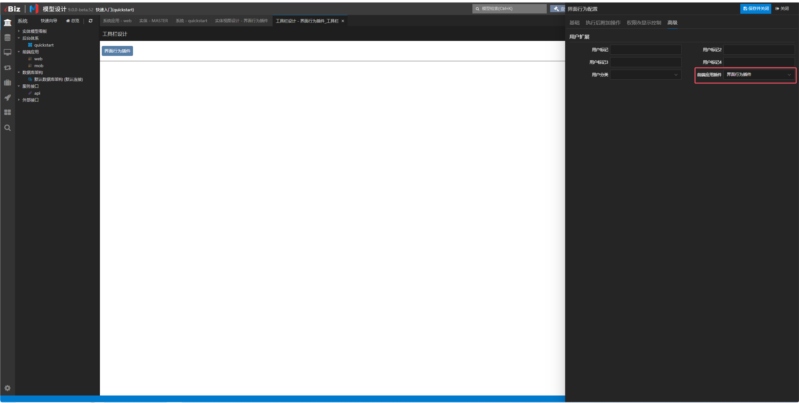
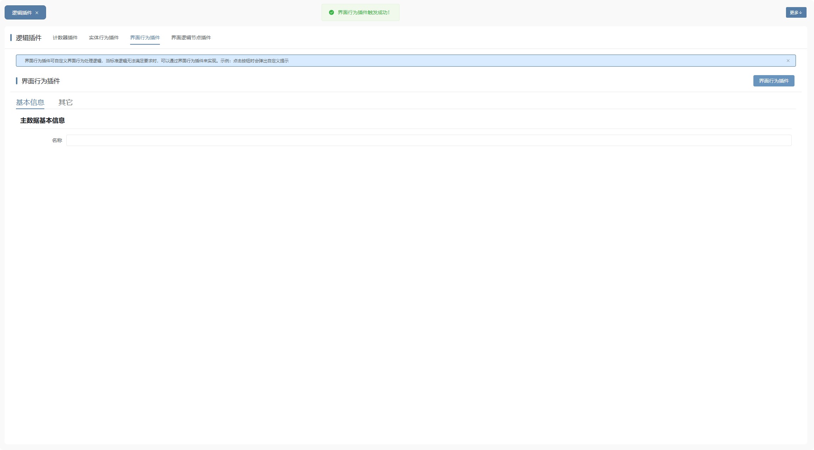

# 界面行为插件

## 新建应用实体界面行为插件

新建应用实体界面行为插件，这儿唯一需要注意一点的是，运行时插件模式同时支持远程运行时插件，在实际运用的时候需根据当前项目所选择的插件模式来定义。详情参见 [运行时插件模式](./RUNTIME-PLUGIN-MODE.md) 篇。



## 在对应的界面行为上绑定插件



## 插件机制

执行界面行为时，会通过模型获取对应的界面行为适配器，然后再执行界面行为适配器的exec方法。详情如下：

```tsx
// 执行界面行为
async exec(
  actionId: string,
  params: IUILogicParams,
  appId: string,
): Promise<IUIActionResult> {
  const action = await getUIActionById(actionId, appId);
  if (!action) {
    throw new RuntimeError(
      ibiz.i18n.t('runtime.uiAction.noFoundBehaviorModel', { actionId }),
    );
  }
  // 单项数据的界面行为执行前校验表单的数据，不通过则拦截
  if (action.actionTarget === 'SINGLEDATA') {
    const validateResult = await params.view.call(ViewCallTag.VALIDATE);
    if (validateResult === false) {
      return { cancel: true };
    }
  }
  const provider = await getUIActionProvider(action);
  return provider.exec(action, params);
}
```

## 插件示例

### 插件效果

点击按钮时会弹出自定义提示



### 插件结构

```
|─ ─ ui-action-plugin                         界面行为插件顶层目录，可根据实际业务命名
  |─ ─ src                                    界面行为插件源代码目录
​    |─ ─ ui-action-plugin.provider.ts         界面行为插件适配器
​    |─ ─ index.ts                             界面行为插件入口文件
```

### 界面行为插件入口文件

界面行为插件入口文件会全局注册界面行为插件适配器，供外部使用。

```typescript
import { App } from 'vue';
import { registerUIActionProvider } from '@ibiz-template/runtime';
import { UiActionPluginProvider } from './ui-action-plugin.provider';

export default {
  install(_app: App) {
    // 全局注册界面行为插件适配器，DEUIACTION是插件类型，R9ActionPluginId是插件标识
    registerUIActionProvider(
      'DEUIACTION_R9ActionPluginId',
      () => new UiActionPluginProvider(),
    );
  },
};
```

### 界面行为插件适配器

界面行为插件适配器主要通过重写execAction方法去自定义界面行为逻辑。

## 本地开发

1. 安装依赖并link至全局

```sh
// 安装依赖
pnpm i

// 启动
pnpm dev

// link到全局
pnpm link --global
```

2. 主项目包中引用插件

```sh
// link插件
pnpm link --global '@ibiz-plugin-template/ui-action-plugin'
```

3. 主项目包中注册插件

```ts
import { App } from 'vue';
import UiActionPlugin from '@ibiz-plugin-template/ui-action-plugin';

export default {
  install(app: App): void {
    app.use(UiActionPlugin);
    // 设置本地开发需要忽略加载的插件，可填写正则或全匹配字符串。匹配插件在modeling建模平台配置的[运行时插件仓库配置]内容
    ibiz.plugin.setDevIgnore(/^@ibiz-plugin-template\/ui-action-plugin/);
  },
};
```
