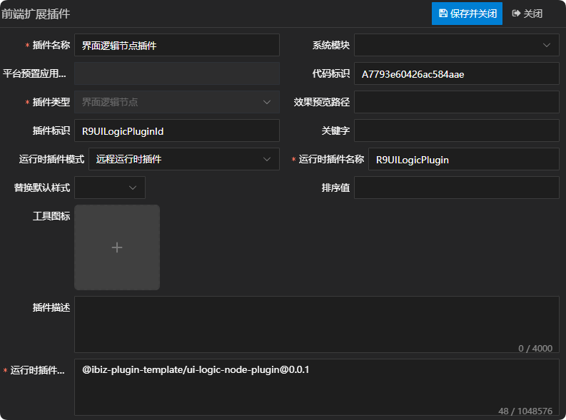
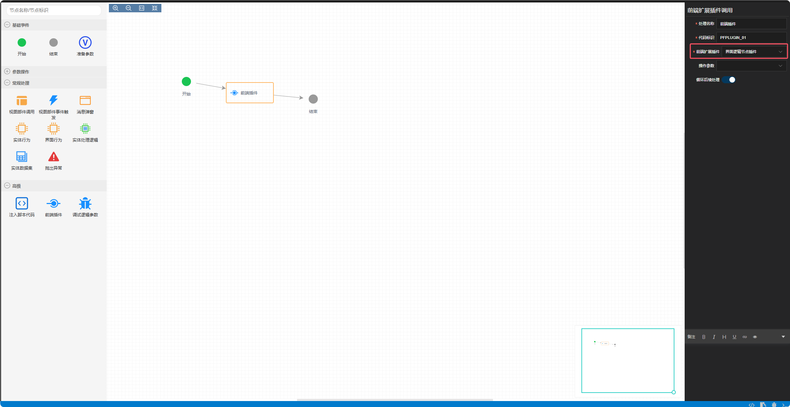

# 界面逻辑节点插件

## 新建界面逻辑节点插件

新建界面逻辑节点插件，这儿唯一需要注意一点的是，运行时插件模式同时支持远程运行时插件，在实际运用的时候需根据当前项目所选择的插件模式来定义。详情参见 [运行时插件模式](./RUNTIME-PLUGIN-MODE.md) 篇。



## 在对应的前端插件节点上绑定插件



## 插件机制

界面逻辑节点执行时，会通过模型获取对应的界面逻辑节点适配器，然后再执行界面逻辑节点的exec方法。详情如下：

```tsx
// 界面逻辑节点执行
async exec(ctx: UILogicContext): Promise<void> {
  ibiz.log.debug(
    ibiz.i18n.t('runtime.uiLogic.interfaceLogicNodeFrontendPlugin', {
      id: this.model.id,
      sysPFPluginId: this.model.sysPFPluginId,
    }),
  );
  const provider = await getUILogicNodeProvider(this.model);
  if (provider) {
    await provider.exec(this.model, ctx);
  }
}
```

## 插件示例

### 插件效果

表单加载草稿数据成功后会弹出自定义提示


### 插件结构

```
|─ ─ ui-logic-node-plugin                  界面逻辑节点插件顶层目录，可根据实际业务命名
  |─ ─ src                                 界面逻辑节点插件源代码目录
​    |─ ─ ui-logic-node-plugin.provider.ts  界面逻辑节点插件适配器
​    |─ ─ index.ts                          界面逻辑节点插件入口文件
```

### 界面逻辑节点插件入口文件

界面逻辑节点插件入口文件会全局注册界面逻辑节点插件适配器，供外部使用。

```typescript
import { App } from 'vue';
import { registerUILogicNodeProvider } from '@ibiz-template/runtime';
import { UiLogicNodePluginProvider } from './ui-logic-node-plugin.provider';

export default {
  install(_app: App) {
    // 全局注册界面逻辑节点插件适配器，UILOGICNODE是插件类型，R9UILogicPluginId是插件标识
    registerUILogicNodeProvider(
      'UILOGICNODE_R9UILogicPluginId',
      () => new UiLogicNodePluginProvider(),
    );
  },
};
```

### 界面逻辑节点插件适配器

界面逻辑节点插件适配器主要通过实现exec方法去自定义界面逻辑节点执行逻辑。

## 本地开发

1. 安装依赖并link至全局

```sh
// 安装依赖
pnpm i

// 启动
pnpm dev

// link到全局
pnpm link --global
```

2. 主项目包中引用插件

```sh
// link插件
pnpm link --global '@ibiz-plugin-template/ui-logic-node-plugin'
```

3. 主项目包中注册插件

```ts
import { App } from 'vue';
import UiLogicNodePlugin from '@ibiz-plugin-template/ui-logic-node-plugin';

export default {
  install(app: App): void {
    app.use(UiLogicNodePlugin);
    // 设置本地开发需要忽略加载的插件，可填写正则或全匹配字符串。匹配插件在modeling建模平台配置的[运行时插件仓库配置]内容
    ibiz.plugin.setDevIgnore(/^@ibiz-plugin-template\/ui-logic-node-plugin/);
  },
};
```
