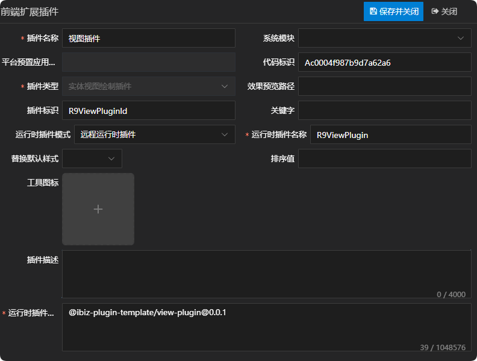
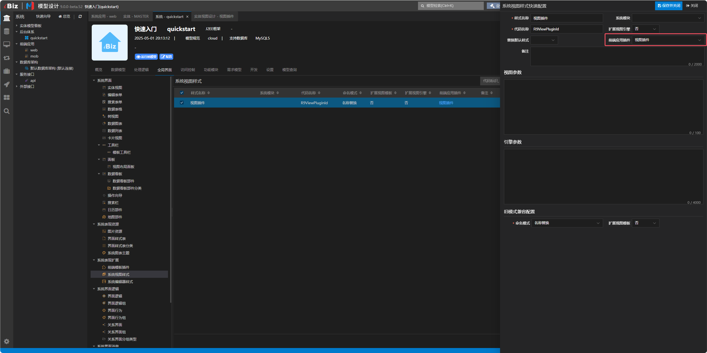
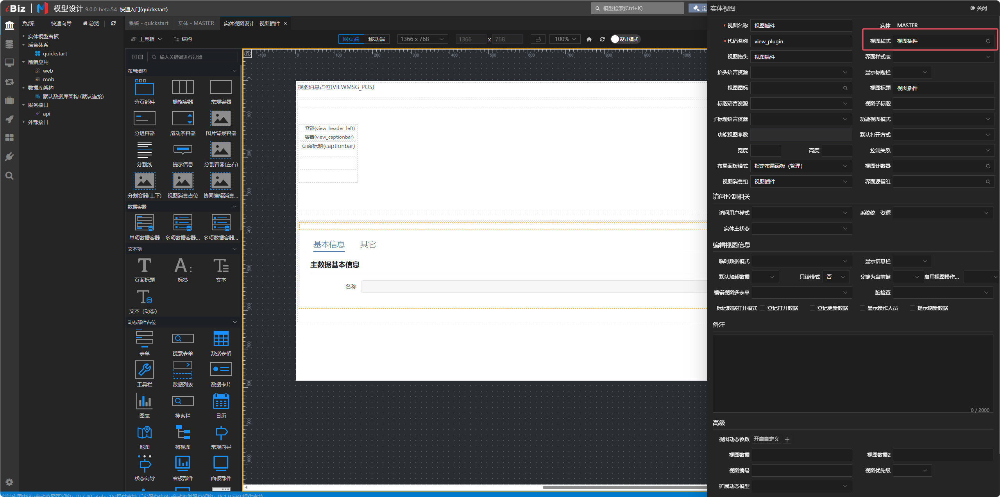
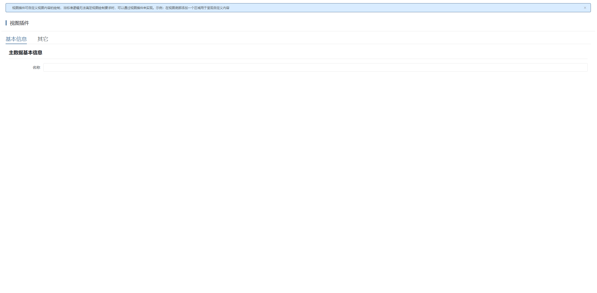
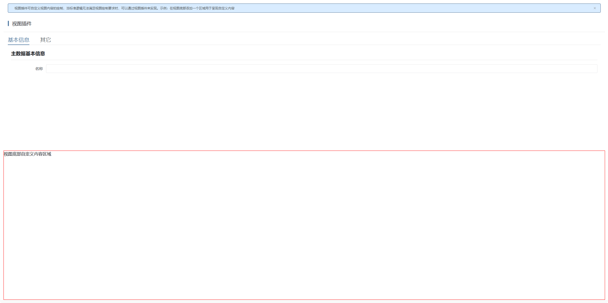

# 视图插件

## 新建实体视图绘制插件

新建实体视图绘制插件，这儿唯一需要注意一点的是，运行时插件模式同时支持远程运行时插件，在实际运用的时候需根据当前项目所选择的插件模式来定义。详情参见 [运行时插件模式](./RUNTIME-PLUGIN-MODE.md) 篇。



## 新建视图样式

新建视图样式，并且绑定上一步新建的视图插件。



## 在对应的视图上绑定视图样式

这儿以编辑视图为例：



## 插件机制

view-shell视图层在绘制具体视图时，是通过视图适配器上的component属性去获取组件，然后进行绘制的。详情如下：

```tsx
// 绘制视图
render() {
  if (this.isComplete && this.provider && this.hasAuthority) {
    return h(
      resolveComponent(this.provider.component) as string,
      {
        context: this.curContext,
        params: this.curParams,
        modelData: clone(this.viewModelData),
        ...this.$attrs,
        provider: this.provider,
        onRedrawView: this.redrawView,
      },
      this.$slots,
    );
  }
  // 无权限访问绘制403界面
  if (!this.hasAuthority) {
    const provider = getErrorViewProvider('403');
    if (provider) {
      if (typeof provider.component === 'string') {
        return h(resolveComponent(provider.component) as string);
      }
      return h(provider.component);
    }
  }
  return (
    <div class={this.ns.b()} v-loading={!this.isComplete}>
      {this.isComplete ? this.errMsg : null}
    </div>
  );
},
```

如果视图适配器配置了createController方法，则使用createController方法返回的控制器，否则使用传入的控制器。如只需修改控制器逻辑但不改变UI呈现，可直接通过createController方法返回新的控制器即可。详情如下：

```tsx
// 获取视图控制器
function useViewController<T extends IViewController>(
  fn: (...args: ConstructorParameters<typeof ViewController>) => T,
): T {
  // 获取 props
  const props = useProps();
  // 获取上层组件的ctx
  const ctx = inject<CTX | undefined>('ctx', undefined);
  // 上下文里提前预告部件
  ctx?.evt.emit('onForecast', props.modelData.name!);

  // 实例化视图控制器
  const provider = props.provider as IViewProvider | undefined;
  let c: IViewController;
  if (provider?.createController) {
    // 如果适配器给了创建方法使用适配器的方法
    c = provider.createController(
      props.modelData,
      props.context,
      props.params,
      ctx,
    ) as T;
  } else {
    c = fn(props.modelData, props.context, props.params, ctx) as T;
  }

  ibiz.util.viewStack.add(c.id, c);

  watchAndUpdateContextParams(props, c);
  watchAndUpdateState(props, c);

  // 提供自身的ctx给下层组件
  provide('ctx', (c as any).ctx);
  // 让state 响应式
  c.state = reactive(c.state) as any;

  // 让state 响应式
  c.slotProps = reactive(c.slotProps) as any;

  // 从props赋值modal,如果存在的话。
  if (props.modal) {
    c.modal = props.modal;
  }

  onActivated(() => {
    c.onActivated();
    ibiz.util.viewStack.active(c.id);
  });

  onDeactivated(() => {
    c.onDeactivated();
    ibiz.util.viewStack.deactivate(c.id);
  });

  c.force = useForce();

  const vue = getCurrentInstance()!.proxy!;
  c.evt.onAll((eventName, event) => {
    vue.$emit(eventName.slice(2), event);
  });

  c.created();

  // 卸载时销毁
  onBeforeUnmount(() => {
    c.destroyed();
    ibiz.util.viewStack.remove(c.id);
  });
  return c as T;
}
```

## 插件示例

### 插件效果

#### 使用插件前



#### 使用插件后



### 插件结构

```
|─ ─ view-plugin                          视图插件顶层目录，可根据实际业务命名
  |─ ─ src                                视图插件源代码目录
​    |─ ─ view-plugin.controller.ts        视图插件控制器
​    |─ ─ view-plugin.engine.ts            视图插件引擎
​    |─ ─ view-plugin.provider.ts          视图插件适配器
​    |─ ─ view-plugin.scss                 视图插件样式
​    |─ ─ view-plugin.tsx                  视图插件组件
​    |─ ─ index.ts                         视图插件入口文件
```

### 视图插件入口文件

视图插件入口文件会全局注册视图插件适配器和视图插件组件，供外部使用。

```typescript
import { App } from 'vue';
import { registerViewProvider } from '@ibiz-template/runtime';
import { ViewPlugin } from './view-plugin';
import { ViewPluginProvider } from './view-plugin.provider';

export default {
  install(app: App) {
    // 全局注册视图插件组件
    app.component(ViewPlugin.name!, ViewPlugin);
    // 全局注册视图插件适配器，VIEW_CUSTOM是插件类型，R9ViewPluginId是插件标识
    registerViewProvider(
      'VIEW_CUSTOM_R9ViewPluginId',
      () => new ViewPluginProvider(),
    );
  },
};
```

### 视图插件组件

视图插件组件使用tsx的书写方式，承载视图绘制的内容，可拷贝基础UI绘制，然后根据需求进行调整。其中，基础UI绘制可参考附录中UI呈现部分。

### 视图插件适配器

视图插件适配器主要通过component属性指定视图实际要绘制的组件，并且通过createController方法返回传递给视图的控制器。

### 视图插件控制器

视图插件控制器可继承基础控制器，然后根据需求进行调整。其中，基础控制器可参考附录中控制器部分。

### 视图插件引擎

视图插件引擎可继承基础引擎，然后根据需求进行调整。其中，基础引擎可参考附录中引擎部分。

## 本地开发

1. 安装依赖并link至全局

```sh
// 安装依赖
pnpm i

// 启动
pnpm dev

// link到全局
pnpm link --global
```

2. 主项目包中引用插件

```sh
// link插件
pnpm link --global '@ibiz-plugin-template/view-plugin'
```

3. 主项目包中注册插件

```ts
import { App } from 'vue';
import ViewPlugin from '@ibiz-plugin-template/view-plugin';

export default {
  install(app: App): void {
    app.use(ViewPlugin);
    // 设置本地开发需要忽略加载的插件，可填写正则或全匹配字符串。匹配插件在modeling建模平台配置的[运行时插件仓库配置]内容
    ibiz.plugin.setDevIgnore(/^@ibiz-plugin-template\/view-plugin/);
  },
};
```

## 附录

|            视图类型            |    UI呈现     |           控制器            |           引擎           |
| :----------------------------: | :-----------: | :-------------------------: | :----------------------: |
|        应用数据导入视图        |     View      | AppDataUploadViewController | AppDataUploadViewEngine  |
|          日历导航视图          |     View      |       ViewController        |  CalendarExpViewEngine   |
|            日历视图            |     View      |       ViewController        |    CalendarViewEngine    |
|          图表导航视图          |     View      |       ViewController        |    ChartExpViewEngine    |
|            图表视图            |     View      |       ViewController        |     ChartViewEngine      |
|           自定义视图           |     View      |       ViewController        |     CustomViewEngine     |
|          卡片导航视图          |     View      |       ViewController        |  DataViewExpViewEngine   |
|            卡片视图            |     View      |       ViewController        |      DataViewEngine      |
|          实体首页视图          |     View      |       ViewController        |    DEIndexViewEngine     |
|            编辑视图            |     View      |       ViewController        |      EditViewEngine      |
|     编辑视图2（左右关系）      |     View      |       ViewController        |     EditView2Engine      |
|     编辑视图3（分页关系）      |     View      |       ViewController        |     EditView3Engine      |
|     编辑视图4（上下关系）      |     View      |       ViewController        |     EditView4Engine      |
|        表单选择数据视图        |     View      |       ViewController        | FormPickupDataViewEngine |
|           甘特图视图           |     View      |       ViewController        |     GanttViewEngine      |
|          表格导航视图          |     View      |       ViewController        |    GridExpViewEngine     |
|            表格视图            |     View      |       ViewController        |      GridViewEngine      |
|            首页视图            |     View      |       ViewController        |     IndexViewEngine      |
|            看板视图            |     View      |       ViewController        |     KanbanViewEngine     |
|          列表导航视图          |     View      |       ViewController        |    ListExpViewEngine     |
|            列表视图            |     View      |       ViewController        |      ListViewEngine      |
|            登录视图            |     View      |       ViewController        |     LoginViewEngine      |
|            地图视图            |     View      |       ViewController        |      MapViewEngine       |
|        多数据自定义视图        |     View      |       ViewController        |    MDCustomViewEngine    |
|         多表单编辑视图         |     View      |       ViewController        |     MEditView9Engine     |
|         多数据选择视图         |     View      |       ViewController        |    MPickupViewEngine     |
|   多数据选择视图（左右关系）   |     View      |       ViewController        |    MPickupView2Engine    |
|          选项操作视图          |     View      |       ViewController        |      OptViewEngine       |
|            面板视图            |     View      |       ViewController        |     PanelViewEngine      |
|          选择数据视图          |     View      |       ViewController        |   PickupDataViewEngine   |
|          选择表格视图          |     View      |       ViewController        |   PickupGridViewEngine   |
|           选择树视图           |     View      |       ViewController        |   PickupTreeViewEngine   |
|          数据选择视图          |     View      |       ViewController        |     PickupViewEngine     |
|     数据选择视图(左右关系)     |     View      |       ViewController        |    PickupView2Engine     |
|          数据看板视图          |  PortalView   |       ViewController        |     PortalViewEngine     |
|            报表视图            |     View      |       ViewController        |     ReportViewEngine     |
|         子系统引用视图         | SubAppRefView |       ViewController        |   SubAppRefViewEngine    |
|          分页导航视图          |     View      |       ViewController        |     TabExpViewEngine     |
|          分页搜索视图          |     View      |       ViewController        |   TabSearchViewEngine    |
|           树导航视图           |     View      |       ViewController        |    TreeExpViewEngine     |
|       树表格视图（增强）       |     View      |       ViewController        |   TreeGridExViewEngine   |
|           树表格视图           |     View      |       ViewController        |    TreeGridViewEngine    |
|             树视图             |     View      |       ViewController        |      TreeViewEngine      |
|       工作流动态操作视图       |     View      |       ViewController        |  WFDynaActionViewEngine  |
|       工作流动态编辑视图       |     View      |       ViewController        |   WFDynaEditViewEngine   |
| 工作流动态编辑视图（分页关系） |     View      |       ViewController        |  WFDynaEditView3Engine   |
|       工作流动态启动视图       |     View      |       ViewController        |  WFDynaStartViewEngine   |
|      应用流程处理记录视图      |     View      |       ViewController        |   WFStepDataViewEngine   |
|            向导视图            |     View      |       ViewController        |     WizardViewEngine     |
